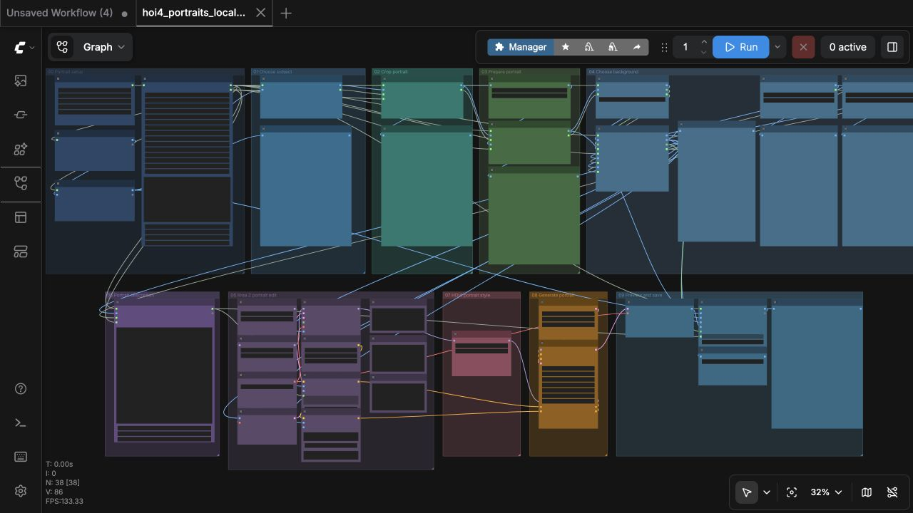
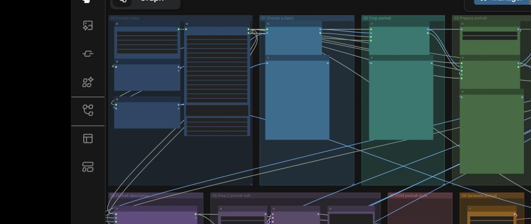
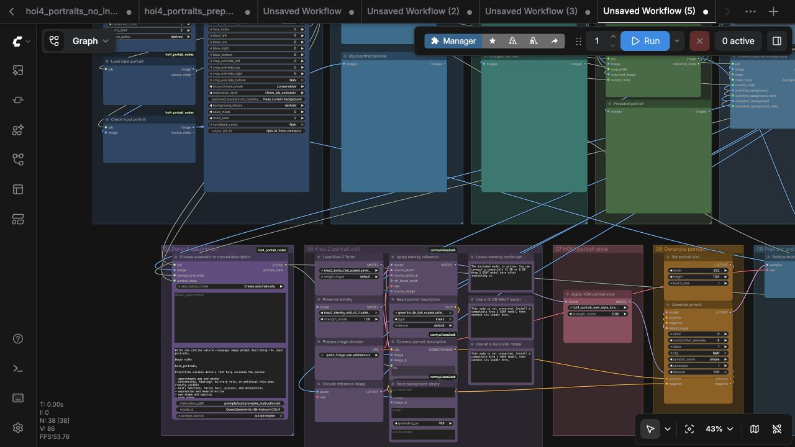
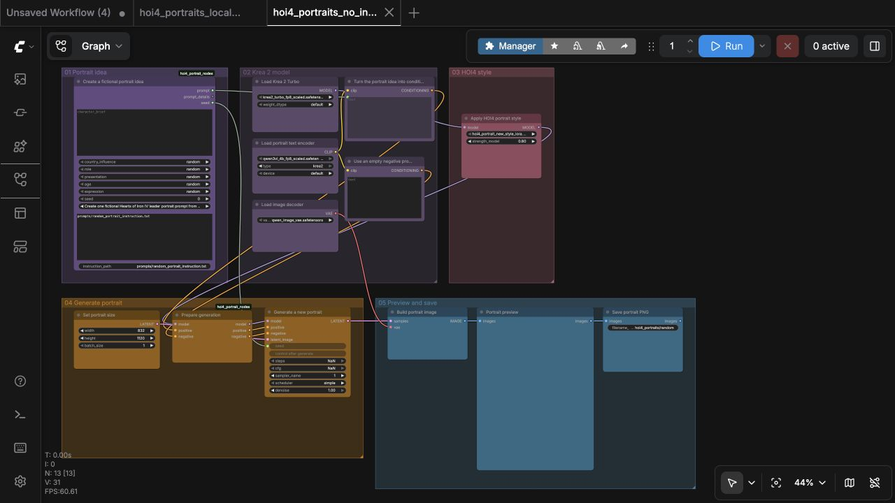
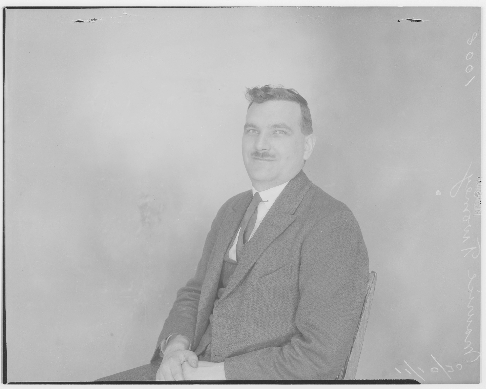
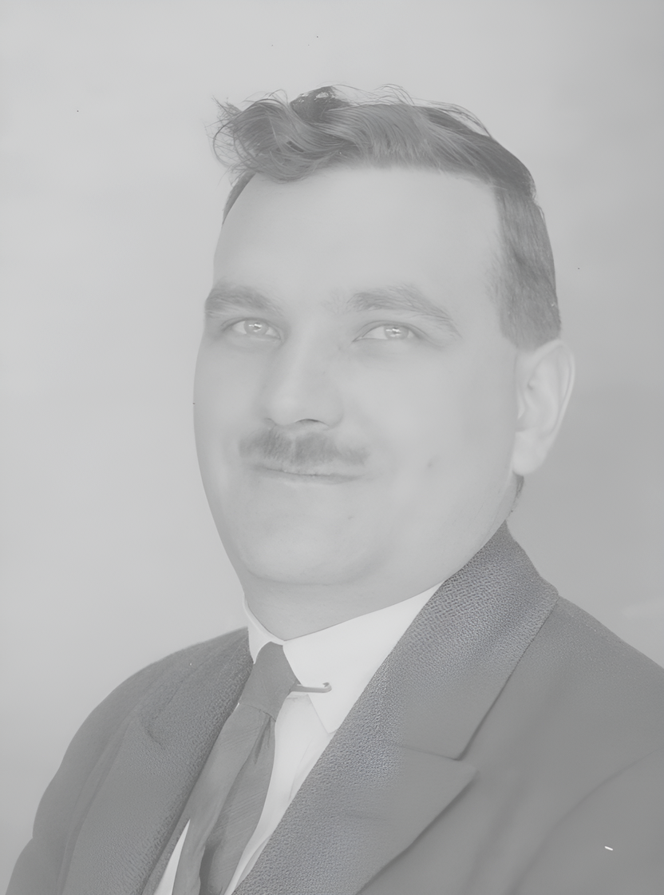
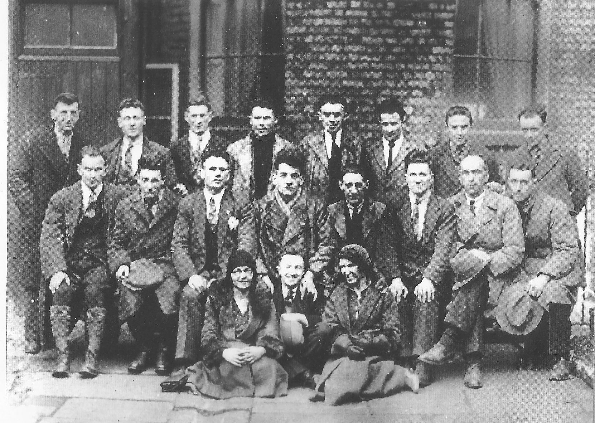
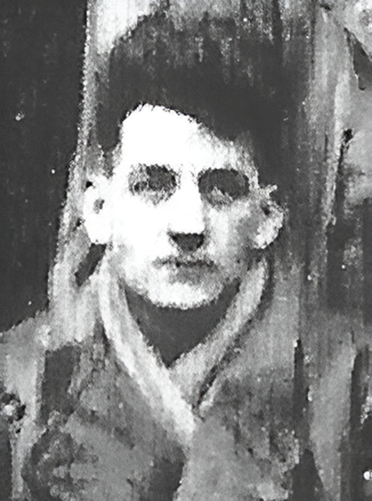
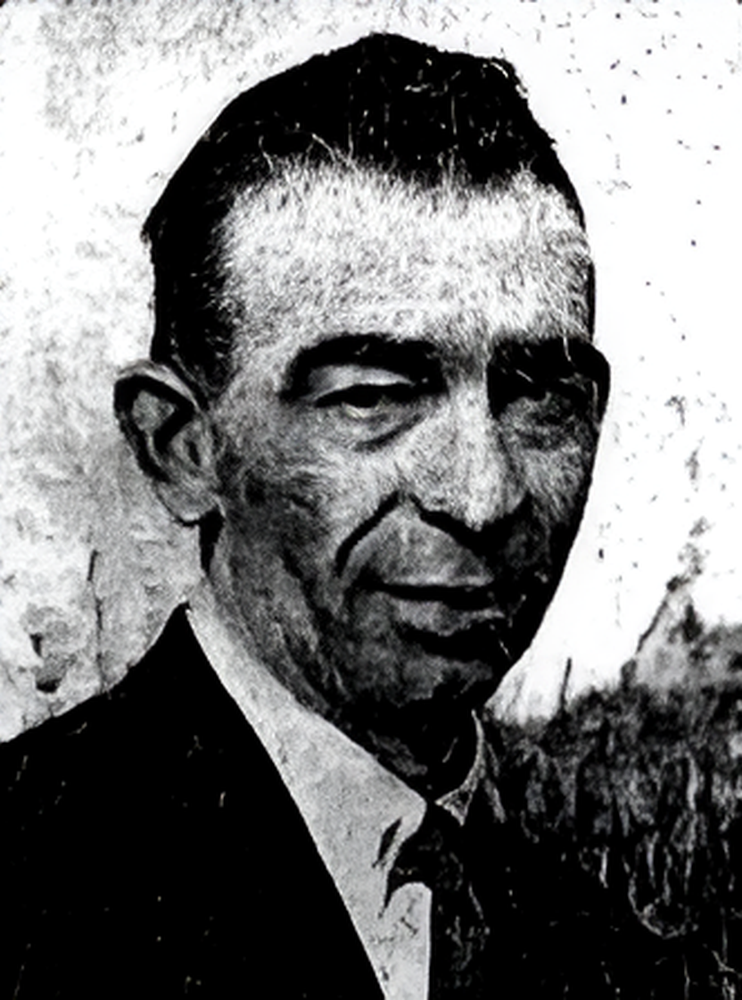

# HOI4 Portrait Workflows for ComfyUI

Turn portrait photos into Hearts of Iron IV-style leader portraits with ComfyUI. Full-power source workflows use Krea 2 Turbo for both portrait restoration and HOI4 styling. The 16 GB workflows use Real-ESRGAN preparation to keep memory use lower.

> 🎥 **YouTube tutorial: coming soon.** The video link will be added here.

[Download the latest package](https://github.com/klimPaskov/comfyui-hoi4-portraits/releases). ComfyUI is installed separately; the included setup scripts add the workflows, required nodes, and model files to an existing ComfyUI installation.

## Workflows

| Workflow | Use | Prompt source |
| --- | --- | --- |
| [`hoi4_portraits_local_nvidia_16gb`](workflows/human/local_nvidia_16gb/hoi4_portraits_local_nvidia_16gb.json) | 12–16 GB NVIDIA GPU, Real-ESRGAN preparation | Automatic or manual |
| [`hoi4_portraits_full_power_gpu`](workflows/human/full_power_gpu/hoi4_portraits_full_power_gpu.json) | RunPod GPU, Krea restoration | Automatic or manual |
| [`hoi4_portraits_no_input_local_nvidia_16gb`](workflows/human/no_input_local_nvidia_16gb/hoi4_portraits_no_input_local_nvidia_16gb.json) | 12–16 GB NVIDIA GPU, no input image | Random builder or manual |
| [`hoi4_portraits_no_input_full_power_gpu`](workflows/human/no_input_full_power_gpu/hoi4_portraits_no_input_full_power_gpu.json) | RunPod GPU, no input image | Random builder or manual |

Every source-image workflow automatically finds the subject and crops to a head-and-shoulders portrait.

Matching agent workflows are included for every workflow type, but they currently have no practical use because ComfyUI does not yet provide a reliable MCP connection for running them.

## Windows setup

1. Install ComfyUI.
2. Clone this repository.
3. Run the installer from PowerShell:

```powershell
.\scripts\install_windows.ps1 `
  -ComfyUIRoot "C:\path\to\ComfyUI" `
  -Profile hoi4_portraits_local_nvidia_16gb
```

Start the workflow:

```powershell
.\scripts\start_windows.ps1 `
  -ComfyUIRoot "C:\path\to\ComfyUI" `
  -Workflow hoi4_portraits_local_nvidia_16gb
```

The setup script installs the nodes and models in their correct folders and adds the workflows to ComfyUI.

## RunPod setup

Open a terminal in a RunPod ComfyUI template and paste the command below. It installs the workflows and downloads Krea 2 Turbo, its encoders, the style LoRA, Real-ESRGAN, and the other required files. It does not install or replace ComfyUI.

```bash
bash -lc 'set -e; P=/workspace/comfyui-hoi4-portraits; test -d "$P/.git" || git clone https://github.com/klimPaskov/comfyui-hoi4-portraits.git "$P"; "$P/scripts/install_runpod.sh" /workspace/ComfyUI'
```

Qwen Image Edit is optional and is not downloaded by the command above. To add its separate preparation workflow:

```bash
/workspace/comfyui-hoi4-portraits/scripts/install_runpod_qwen.sh /workspace/ComfyUI
```

Then start ComfyUI:

```bash
/workspace/comfyui-hoi4-portraits/scripts/start_runpod.sh /workspace/ComfyUI
```

Open `Workflows > hoi4_portraits` in ComfyUI to choose any installed workflow.

See the [RunPod guide](docs/runpod.md) for folder locations and SSH access.

## Workflow overview



The first row loads the source, selects the person, crops the portrait, and prepares it automatically:



The final row applies the Krea identity reference and HOI4 LoRA, generates the portrait, then shows the same image that will be saved:



### Generate a new leader from a prompt

Enter an optional brief and let the workflow vary the remaining details, or switch the first node to **Use my prompt**. No input image or separate vision autoprompter is used.



### Prepare a portrait

[`hoi4_portraits_prepare_portrait_for_hoi4`](workflows/human/prepare_portrait/hoi4_portraits_prepare_portrait_for_hoi4.json) is the full-power preparation workflow. It tightly crops the subject, restores and optionally colorizes the photo with Krea Edit, and saves an 832 × 1120 PNG. Its restoration setting lets you preserve the original color treatment or write custom instructions.

[`hoi4_portraits_prepare_portrait_basic`](workflows/human/prepare_portrait_basic/hoi4_portraits_prepare_portrait_basic.json) is the model-free alternative for cropping, resizing, contrast, and sharpness adjustments.

The examples below show the lighter Real-ESRGAN preparation used in the 16 GB source workflow:

| Source | Prepared portrait |
| --- | --- |
|  |  |
|  |  |
|  |  |

## Portrait examples

| Before | After |
| --- | --- |
|  |  |
|  |  |
|  |  |

## Guides

- [Getting started](docs/getting-started.md)
- [RunPod setup](docs/runpod.md)
- [Workflow guide](docs/workflows.md)
- [Install with a coding agent](docs/setup-with-coding-agent.md)

## License

Project code is MIT licensed. ComfyUI, Krea, Qwen, and model files keep their own licenses. The style LoRA is downloaded from its [Hugging Face page](https://huggingface.co/Hoops-McCann/hoi4-portrait-new-style-lora).
