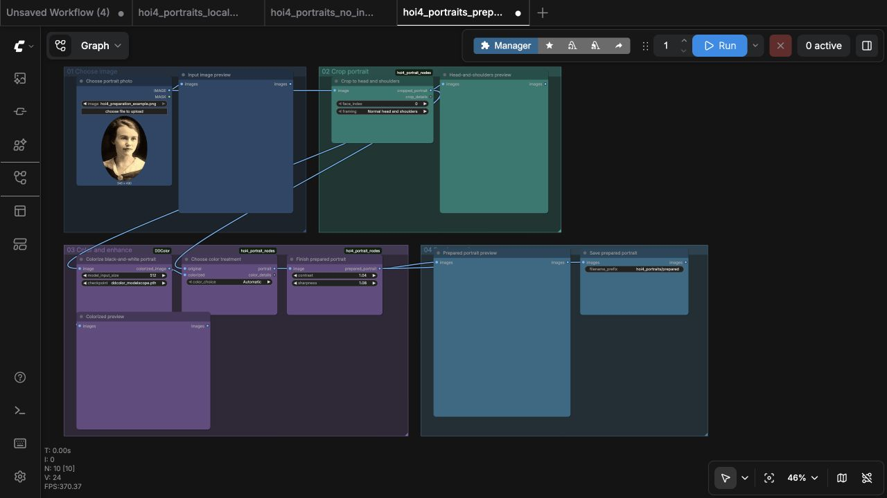
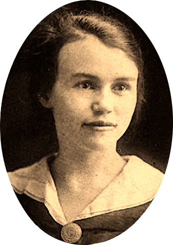
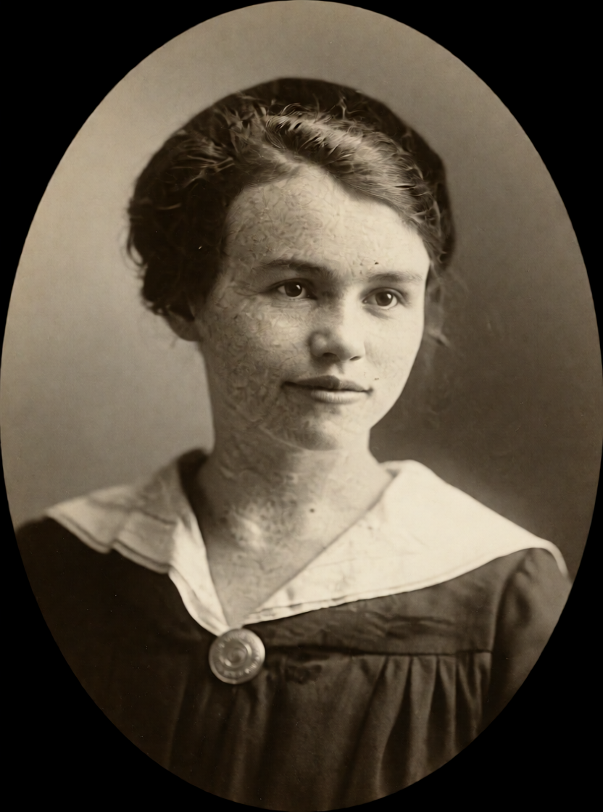

# HOI4 Portrait Workflows for ComfyUI

Turn portrait photos into Hearts of Iron IV-style leader portraits with Krea 2 Turbo. The project includes ready-to-use ComfyUI workflows, automatic setup scripts, custom nodes, previews, and the HOI4 style LoRA.

> 🎥 **YouTube tutorial: coming soon.** The video link will be added here.

[Download the latest package](https://github.com/klimPaskov/comfyui-hoi4-portraits/releases). ComfyUI is installed separately; the included setup scripts add the workflows, required nodes, and model files to an existing ComfyUI installation.

## Workflows

| Workflow | Use | Prompt source |
| --- | --- | --- |
| [`hoi4_portraits_local_nvidia_16gb`](workflows/human/local_nvidia_16gb/hoi4_portraits_local_nvidia_16gb.json) | 12–16 GB NVIDIA GPU | Built-in portrait autoprompter |
| [`hoi4_portraits_agent_local_nvidia_16gb`](workflows/agent/local_nvidia_16gb/hoi4_portraits_agent_local_nvidia_16gb.json) | 12–16 GB NVIDIA GPU | Job file |
| [`hoi4_portraits_full_power_gpu`](workflows/human/full_power_gpu/hoi4_portraits_full_power_gpu.json) | RunPod GPU | Built-in portrait autoprompter |
| [`hoi4_portraits_agent_full_power_gpu`](workflows/agent/full_power_gpu/hoi4_portraits_agent_full_power_gpu.json) | RunPod GPU | Job file |
| [`hoi4_portraits_no_input_local_nvidia_16gb`](workflows/human/no_input_local_nvidia_16gb/hoi4_portraits_no_input_local_nvidia_16gb.json) | 12–16 GB NVIDIA GPU, no input image | Text-only random portrait builder |
| [`hoi4_portraits_no_input_full_power_gpu`](workflows/human/no_input_full_power_gpu/hoi4_portraits_no_input_full_power_gpu.json) | RunPod GPU, no input image | Text-only random portrait builder |
| [`hoi4_portraits_agent_no_input_local_nvidia_16gb`](workflows/agent/no_input_local_nvidia_16gb/hoi4_portraits_agent_no_input_local_nvidia_16gb.json) | 12–16 GB NVIDIA GPU, no input image | Job file |
| [`hoi4_portraits_agent_no_input_full_power_gpu`](workflows/agent/no_input_full_power_gpu/hoi4_portraits_agent_no_input_full_power_gpu.json) | RunPod GPU, no input image | Job file |

Every source-image workflow automatically crops, colorizes black-and-white photos when needed, and lightly enhances the portrait before generation. Human workflows include large previews for the source image, prepared portrait, background, and saved result. Agent workflows receive their prompt from the job JSON.

> Agent workflows are included for future automation. They are not currently practical through ComfyUI Cloud because Cloud does not yet provide a dependable way to install and run the required custom nodes.

## Windows setup

1. Install ComfyUI.
2. Clone this repository.
3. Run the installer from PowerShell:

```powershell
.\scripts\install_windows.ps1 `
  -ComfyUIRoot "C:\path\to\ComfyUI" `
  -Profile hoi4_portraits_local_nvidia_16gb
```

Start the workflow:

```powershell
.\scripts\start_windows.ps1 `
  -ComfyUIRoot "C:\path\to\ComfyUI" `
  -Workflow hoi4_portraits_local_nvidia_16gb
```

The setup script installs the nodes and models in their correct folders and adds the workflows to ComfyUI.

## RunPod setup

Open a terminal in a RunPod ComfyUI template and paste the command below. It installs all included workflows and downloads Krea 2 Turbo and the other required model files; it does not install or replace ComfyUI.

```bash
bash -lc 'set -e; P=/workspace/comfyui-hoi4-portraits; test -d "$P/.git" || git clone https://github.com/klimPaskov/comfyui-hoi4-portraits.git "$P"; "$P/scripts/install_runpod.sh" /workspace/ComfyUI'
```

Then start ComfyUI:

```bash
/workspace/comfyui-hoi4-portraits/scripts/start_runpod.sh /workspace/ComfyUI
```

Open `Workflows > hoi4_portraits` in ComfyUI to choose any installed workflow.

See the [RunPod guide](docs/runpod.md) for folder locations and SSH access.

## Workflow overview


The first row loads the source, selects the person, crops the portrait, and prepares it automatically:


The final row applies the Krea identity reference and HOI4 LoRA, generates the portrait, then shows the same image that will be saved:


### Generate a new leader from a prompt

Choose a country influence, role, age, presentation, expression, and seed. No input image or separate vision autoprompter is used.

Agents can use the matching `hoi4_portraits_agent_no_input_*` workflow with the [no-input job example](docs/examples/prompt_job_input.example.json).


### Portrait preparation utility

The same preparation is already part of every source-image workflow. [`hoi4_portraits_prepare_portrait_for_hoi4`](workflows/human/prepare_portrait/hoi4_portraits_prepare_portrait_for_hoi4.json) is also available when you only want a clean 832 × 1120 head-and-shoulders PNG without generating a new portrait.



| Nora source | Prepared portrait |
| --- | --- |
|  |  |

## Portrait examples

| Before | After |
| --- | --- |
|  |  |
|  |  |
|  |  |

## Guides

- [Getting started](docs/getting-started.md)
- [RunPod setup](docs/runpod.md)
- [Workflow guide](docs/workflows.md)
- [Install with a coding agent](docs/setup-with-coding-agent.md)

## License

Project code is MIT licensed. ComfyUI, Krea, Qwen, and model files keep their own licenses. The style LoRA is downloaded from its [Hugging Face page](https://huggingface.co/Hoops-McCann/hoi4-portrait-new-style-lora).
