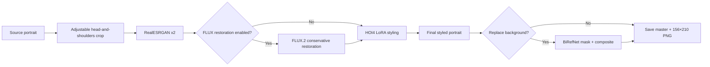

# HOI4 portraits with FLUX.2 Klein 9B

[](https://github.com/klimPaskov/comfyui-hoi4-portraits/actions/workflows/ci.yml)
[](LICENSE)
[](https://huggingface.co/Hoops-McCann/hoi4-portraits-flux2-klein-9b-lora)

Clean ComfyUI workflows for generating Hearts of Iron IV-style leader portraits
from photographs or written character descriptions. The default model stack
is **FLUX.2 Klein base 9B** plus the project’s `hoi4_portrait` LoRA.

All workflows use built-in ComfyUI nodes only. There is no project custom-node
pack, Krea dependency, or hidden sidecar service, so the same graphs open
locally and in Comfy Cloud.

## Workflows

| Workflow | Best for | Restoration path |
| --- | --- | --- |
| [`hoi4_portrait_flux2_klein_9b_full_power`](workflows/hoi4_portrait_flux2_klein_9b_full_power.json) | Best source-photo quality; 32 GB+ GPU or Comfy Cloud | RealESRGAN first, then switchable FLUX.2 restoration |
| [`hoi4_portrait_flux2_klein_9b_esrgan_only`](workflows/hoi4_portrait_flux2_klein_9b_esrgan_only.json) | Faster source-photo conversion | RealESRGAN only, then FLUX.2 LoRA styling |
| [`hoi4_portrait_flux2_klein_9b_text_to_image`](workflows/hoi4_portrait_flux2_klein_9b_text_to_image.json) | Creating a fictional leader without a source image | No restoration pass |

Matching [API-format graphs](workflows/) are included for Comfy Cloud MCP,
the Comfy Cloud API, and local `/prompt` submission.

Krea 2 and Krea Edit variants are available as optional alternatives in the
[Krea workflow release](https://github.com/klimPaskov/comfyui-hoi4-portraits/releases/tag/v1.0.0).
They are not part of the default workflow table or package.

## What the full workflow does



Background removal and compositing consume the **decoded final LoRA-styled
image**. They do not run on the source, the ESRGAN image, or the restoration
pass.

Both image-to-image stages start from the encoded processed portrait, not an
empty latent canvas. The reference conditioning and sampler therefore share
the same source composition, which reduces unwanted pose and framing changes.

## Fastest start: Comfy Cloud

1. On a Comfy Cloud Creator or Pro plan, open **Models → Import** and import the [public LoRA file](https://huggingface.co/Hoops-McCann/hoi4-portraits-flux2-klein-9b-lora/blob/main/hoi4_portraits_flux2_klein_9b_lora_000002500.safetensors) as a LoRA.
2. Download and open one of the workflow JSON files from the table.
3. For a source workflow, upload a portrait and select it in **Load source portrait**. Set the built-in crop box around the head and shoulders, then check its preview.
4. Upload one of the [`backgrounds/`](backgrounds/) files only if you want background replacement, then turn on the final background switch.
5. Queue the workflow. In full power, turn **Toggle FLUX restoration** off to run ESRGAN-only without rewiring anything.

See [Comfy Cloud setup](docs/comfy-cloud.md) for the exact model-import and MCP
validation flow.

## Local / RunPod start

FLUX.2 Klein 9B needs an up-to-date ComfyUI and substantial memory. Its
upstream model card says the base fits in roughly 29 GB VRAM, so a 32 GB GPU is
the practical local target. Lower-memory systems may require model offloading
and will be slow. The model files use about 19 GB of disk before ComfyUI caches
or outputs.

```bash
git clone https://github.com/klimPaskov/comfyui-hoi4-portraits.git
cd comfyui-hoi4-portraits
python scripts/install_workflows.py --comfyui-root /path/to/ComfyUI
python scripts/download_models.py --comfyui-root /path/to/ComfyUI
```

The FLUX.2 base model is gated. Accept its Hugging Face agreement and run
`hf auth login` (or set `HF_TOKEN`) before the model download command.

For a RunPod ComfyUI template:

```bash
bash -lc 'P=/workspace/comfyui-hoi4-portraits; test -d "$P/.git" || git clone https://github.com/klimPaskov/comfyui-hoi4-portraits.git "$P"; "$P/scripts/install_runpod.sh" /workspace/ComfyUI'
```

Windows users can run:

```powershell
.\scripts\install_windows.ps1 -ComfyUIRoot "C:\path\to\ComfyUI"
```

## Prompting

Keep `hoi4_portrait` at the start of the positive prompt, then describe only
the visible person: face, hair, expression, clothing, pose, gaze, and crop.
Do not describe the game, desired style, background, lighting, rendering,
restoration, or transformation. The LoRA and workflow supply those parts.

```text
hoi4_portrait, a middle-aged man with short dark hair, round wire-frame glasses, a long narrow face, a neat moustache, and a reserved expression, wearing a dark jacket over a light collared shirt and tie, shown from the shoulders up while looking slightly left.
```

The workflows default to the selected `0.7` LoRA strength, Euler sampler, six
steps, and CFG 5. The 8-, 10-, and 20-step control below lets you judge whether
the extra runtime helps your source. See [autoprompter
examples](docs/autoprompter-examples.md) for more person-only prompts.

## Verified examples

These are real local runs with the published LoRA, not mockups. Every source
board is initial source → processed crop → final portrait. Qwen generated the
descriptions; the documented prompt contract was then applied to remove
uncertain or forbidden treatment language before inference.

The evidence boards use 416 × 560 because the test Mac has 16 GB unified
memory. That reduction is the main source of preview softness; the committed
workflows keep an 832 × 1120 canvas. More steps can refine a result but cannot
replace missing spatial resolution, which is why the step control is shown
separately.

### Full restoration


Autoprompter description:

```text
hoi4_portrait, middle-aged man with short wavy hair, a moustache, wearing a suit and tie with a visible collar and lapels, looking slightly upward with a subtle smile, head tilted slightly to his right, shoulders squared, shown from the chest up.
```


Autoprompter description:

```text
hoi4_portrait, young woman with short dark hair parted to the side, no glasses, wearing a high-collared garment with a visible round fastening, looking directly at the camera with a neutral expression, head slightly tilted, shown from the chest up in an oval crop.
```


Autoprompter description:

```text
hoi4_portrait, young man with dark hair parted on the left, clean-shaven, wearing a collared shirt and tie, looking upward and to his right with a slight smile, head tilted, shown from the shoulders up in three-quarter profile with a visible ear, nose, and chin.
```

### ESRGAN only


Autoprompter description:

```text
hoi4_portrait, middle-aged man with short dark hair, no facial hair, wearing a high-collared uniform with decorative cords and a visible medal, looking slightly to his right with a neutral expression, head tilted slightly and mouth closed, shown from the chest up.
```


Autoprompter description:

```text
hoi4_portrait, a man with short dark hair, round-rimmed glasses, no facial hair, and a long narrow face, dressed in a dark suit with a white collared shirt and dark tie, looking directly at the camera with a neutral expression, his head and shoulders angled slightly to his right, shown from the chest up in three-quarter view.
```


Autoprompter description:

```text
hoi4_portrait, middle-aged man with a receding hairline, no facial hair, a prominent nose, defined jaw and chin, wearing a high-collared garment with a decorative corded tie and buttoned front, looking directly at the camera with a neutral expression and a slight head tilt, shown from the chest up.
```

### No-input portraits and step control


See [the three random prompts, exact test conditions, and findings](docs/test-results.md).

## Validation status

- All three editor graphs and API graphs are generated from one deterministic source.
- Link endpoints, slot types, output nodes, visual groups, and node geometry are tested.
- Node and group overlap checks pass with spacing margins.
- Comfy Cloud MCP no-spend preflight passes for all three API graphs;
  the only advisory is the expected project LoRA import.
- Cloud GPU mechanical tests pass every workflow shape and the final
  background branch using a compatible catalog LoRA at zero strength.
- Actual local inference with the project LoRA passes for three full-restoration
  portraits, three ESRGAN-only portraits, three text-to-image portraits, and
  fixed-seed 6/8/10/20-step controls. Reduced 416 × 560 evidence was used on a
  16 GB Apple-silicon Mac; 832 × 1120 remains the workflow canvas.

Run the same checks locally:

```bash
python scripts/build_workflows.py
python scripts/validate_workflows.py
python -m unittest discover -s tests -v
```

## Guides

- [Getting started](docs/getting-started.md)
- [Workflow controls and graph structure](docs/workflows.md)
- [Comfy Cloud and MCP](docs/comfy-cloud.md)
- [Local and RunPod installation](docs/local-install.md)
- [Autoprompter prompt examples](docs/autoprompter-examples.md)
- [Local test results and before/afters](docs/test-results.md)
- [Testing](docs/testing.md)
- [Contributing](CONTRIBUTING.md)
- [Third-party model terms](THIRD_PARTY_LICENSES.md)

## License and trademark

Project-owned code, workflows, documentation, backgrounds, and the published
LoRA are MIT licensed; third-party models retain their own terms. The FLUX.2
Klein 9B base model is gated and non-commercial; using the MIT-licensed
workflow or LoRA does not remove those model restrictions. Hearts of Iron IV
is a trademark of Paradox Interactive. This community project is not
affiliated with or endorsed by Paradox Interactive.
