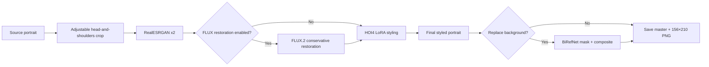
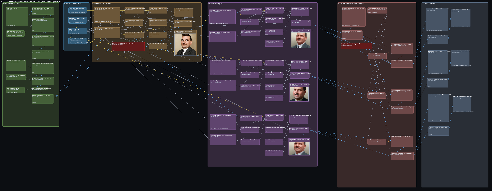
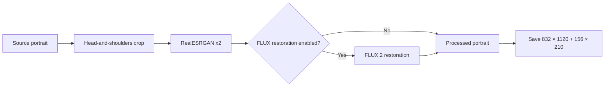

# Identity-preserving HOI4 portraits with FLUX.2 Klein 9B

[](https://github.com/klimPaskov/comfyui-hoi4-portraits/actions/workflows/ci.yml)
[](LICENSE)
[](https://huggingface.co/Hoops-McCann/hoi4-portraits-flux2-klein-9b-lora)

Create identity-preserving Hearts of Iron IV-style leader portraits from source
photographs with ComfyUI. The source workflow keeps the person’s crop, pose,
framing, and facial identity anchored while FLUX.2 Klein 9B prepares and styles
the final portrait.

The same workflow opens locally, on RunPod, and in Comfy Cloud.

## Workflows

| Workflow | Best for | Restoration path |
| --- | --- | --- |
| [`hoi4_portrait_flux2_klein_9b_source`](workflows/hoi4_portrait_flux2_klein_9b_source.json) | Identity-preserving portrait from a source photo | RealESRGAN, optional FLUX.2 restoration, then LoRA styling |
| [`hoi4_portrait_flux2_klein_9b_text_to_image`](workflows/hoi4_portrait_flux2_klein_9b_text_to_image.json) | Fictional portrait without a source photo | No restoration pass |
| [`hoi4_portrait_processing_only`](workflows/hoi4_portrait_processing_only.json) | Prepare a source image before styling | RealESRGAN, then optional FLUX.2 restoration |

Matching [API-format graphs](workflows/) are included for Comfy Cloud MCP,
the Comfy Cloud API, and local `/prompt` submission.

The [latest GitHub release](https://github.com/klimPaskov/comfyui-hoi4-portraits/releases/latest)
contains a model-free ZIP, a Windows x64 self-extractor, and SHA-256 checksums.
The Windows executable only unpacks this project; it does not bundle ComfyUI or
model weights.

Krea 2 and Krea Edit variants are available as optional alternatives in the
[Krea workflow release](https://github.com/klimPaskov/comfyui-hoi4-portraits/releases/tag/v1.0.0).
They are separate alternatives; the table above contains the default FLUX.2
workflows.

## What the source workflow does

These screenshots show the source, crop + ESRGAN, optional restoration,
pre-background LoRA, and final portrait checkpoints from a local ComfyUI queue
run. The source workflow opens with FLUX restoration disabled. The example run
enables the switch so every checkpoint appears on one canvas.





### 1. Crop and restore the source

Load the portrait, set the crop box around the head and shoulders, and confirm
the preview. The cropped image goes through RealESRGAN before it is fitted to
the 832 × 1120 working canvas.


### 2. Load FLUX.2 and the portrait LoRA

This group loads the FLUX.2 Klein 9B base model, Qwen text encoder, VAE, and
the portrait LoRA. Set the LoRA strength to `0.75`.


### 3. Optionally restore with FLUX.2

The source workflow includes a conservative FLUX.2 restoration pass after
ESRGAN. The restoration switch is off by default, so that pass does not run.
Turn it on when a damaged source needs the additional pass.


### 4. Apply the portrait LoRA

The selected processed portrait becomes the reference and starting image for
LoRA styling. Describe only the person in the positive prompt. The defaults are
Euler, eight steps, and CFG 5.


### 5. Optionally replace the background

Background masking and compositing receive the decoded final portrait. This
stage is off by default and runs only after crop, restoration, and LoRA
generation.


### 6. Preview and save

Preview the result, save the 832 × 1120 master PNG, and create the 156 × 210
game-size portrait.


Background removal and compositing consume the **decoded final LoRA-styled
image**. They do not run on the source, the ESRGAN image, or the restoration
pass.

Both image-to-image stages start from the encoded processed portrait, not an
empty latent canvas. The reference conditioning and sampler therefore share
the same source composition, which reduces unwanted pose and framing changes.

## Processing workflow

The processing workflow uses the same crop and RealESRGAN preparation as the
source workflow, then offers the same FLUX restoration switch. It stops before
LoRA styling and saves the selected processed image as both 832 × 1120 and
156 × 210 PNG files.



## Fastest start: Comfy Cloud

1. For the source or text-to-image workflow, use a Comfy Cloud Creator or Pro
   plan, open **Models → Import**, and import the [public LoRA file](https://huggingface.co/Hoops-McCann/hoi4-portraits-flux2-klein-9b-lora/blob/main/hoi4_portraits_flux2_klein_9b_lora_000002500.safetensors) as a LoRA.
2. Download and open one of the workflow JSON files from the table.
3. For a source workflow, upload a portrait and select it in **Load source portrait**. Set the built-in crop box around the head and shoulders, then check its preview.
4. Upload one of the [`backgrounds/`](backgrounds/) files only if you want background replacement, then turn on the final background switch.
5. Queue the workflow. In the source workflow, FLUX restoration is off by
   default; turn **Toggle FLUX restoration** on only when the source needs it.

See [Comfy Cloud setup](docs/comfy-cloud.md) for the exact model-import and MCP
validation flow.

## Experimental: autonomous Comfy Cloud MCP

The MCP path lets an MCP-capable coding agent operate the Cloud workflow from
the source image through installation in a local HOI4 mod. This integration is
experimental. The setup below assumes that you already have:

- a Comfy Cloud **Builder** subscription with Cloud GPU, API, MCP, and custom
  model-import access;
- access to the Comfy Cloud MCP preview;
- the project LoRA imported with the exact filename
  `hoi4_portraits_flux2_klein_9b_lora_000002500.safetensors`;
- an MCP-capable agent with access to this repository and the target mod;
- the mod root, character identifier, output filename, and portrait sprite name
  supplied to the agent. These values are mod-specific and must not be guessed.

### Connect the MCP server

Comfy Cloud hosts the MCP endpoint at `https://cloud.comfy.org/mcp`. In a client
that supports remote OAuth MCP servers, add that URL and complete the Comfy
authorization flow. For API-key clients, create a key at
[`platform.comfy.org/profile/api-keys`](https://platform.comfy.org/profile/api-keys),
then use the official installer:

macOS or Linux:

```bash
curl -fsSL https://raw.githubusercontent.com/Comfy-Org/comfy-cloud-mcp/main/install.sh | bash
```

Windows PowerShell:

```powershell
irm https://raw.githubusercontent.com/Comfy-Org/comfy-cloud-mcp/main/install.ps1 | iex
```

Restart the MCP client after installation. A useful connection check is to ask
the agent to inspect the Comfy Cloud server, find FLUX.2 Klein base 9B and the
imported LoRA, then dry-run the selected `.api.json` graph without submitting a
GPU job.

### What the agent does

With the connection and model import in place, the agent can perform the
portrait job autonomously:

1. Read the appropriate API-format graph from [`workflows/`](workflows/). Use
   source processing with optional FLUX restoration, or processing-only when
   you want an image without LoRA styling.
2. Inspect the source at full resolution and write a short `hoi4_portrait,`
   prompt describing only the person: broad hair or facial-hair cues,
   ethnicity when supported, and general clothing classification. Leave expression, pose, gaze, and facing
   direction to the input reference.
3. Upload the local source through the MCP file-upload flow. Use the returned
   Cloud filename in **Load source portrait**; a local filesystem path is not a
   valid `LoadImage.image` value in Cloud.
4. Set the head-and-shoulders bounding box before processing. The agent should
   exclude printed borders, oval frames, captions, and empty margins while
   keeping the full head, neck, and shoulders.
5. Set the project LoRA to `0.75`, choose whether FLUX restoration is enabled,
   and keep background replacement after the decoded LoRA result. If a custom
   background is requested, upload it separately and replace that loader's
   filename too.
6. Dry-run the modified API graph. Resolve missing nodes, model filenames, or
   invalid input values before submitting any generation.
7. Submit the graph, retain its returned `prompt_id`, and wait for that exact
   job to finish. Queue status alone does not confirm completion.
8. Retrieve and download both the 832 × 1120 master and 156 × 210 game output.
   Visually verify the crop, identity, expression, facial detail, background,
   and absence of frame or vignette artifacts.
9. Copy the approved game portrait into the mod's configured portrait path,
   update the configured `spriteType`/portrait definition and character
   reference when needed, and report the files you edited. Back up existing mod
   files or edit them through version control.

For repeatable autonomous installation, give the agent a small job manifest
instead of relying on prose alone:

```yaml
source_image: /absolute/path/to/source.png
workflow: source
flux_restoration: true
replace_background: true
mod_root: /absolute/path/to/hoi4-mod
portrait_output: gfx/leaders/TAG/leader_name.png
sprite_name: GFX_portrait_TAG_leader_name
character_file: common/characters/TAG_characters.txt
character_id: TAG_leader_name
```

An example request is: “Use Comfy Cloud MCP and the source API workflow to
turn this source into a portrait. Crop to head and shoulders, use the project
LoRA at 0.75, keep FLUX restoration enabled, replace the background only after
the final LoRA image, verify both outputs, and install the 156 × 210 result
according to this manifest.”

The agent should claim success only after the submitted `prompt_id` is complete,
the output is retrieved, and the destination mod files are checked.
Comfy's Cloud API and MCP are experimental and may change.

## Local / RunPod start

FLUX.2 Klein 9B needs an up-to-date ComfyUI and substantial memory. The FP8
workflow is practical on a 24 GB GPU with offloading. An 18 GB GPU may also run
it with more aggressive offloading and a reduced test canvas; 16 GB systems can
run the same kind of reduced-resolution test but will be slower. The upstream model card's roughly
29 GB figure is a conservative full-resolution/no-offload guideline. The six
pinned model files use 19.41 GB decimal (18.08 GiB) before ComfyUI caches or
outputs. For RunPod, a 30 GB volume is sufficient for this project and its
normal outputs.

```bash
git clone https://github.com/klimPaskov/comfyui-hoi4-portraits.git
cd comfyui-hoi4-portraits
python scripts/install_workflows.py --comfyui-root /path/to/ComfyUI
python scripts/download_models.py --comfyui-root /path/to/ComfyUI
```

The FLUX.2 base model is gated. Accept its Hugging Face agreement and run
`hf auth login` (or set `HF_TOKEN`) before the model download command.

For a RunPod ComfyUI template, this command installs the three workflows, the
bundled backgrounds and sample input, and all six pinned model files into the
standard `ComfyUI/models/` subfolders. Set `HF_TOKEN` in the pod environment
first so the gated FLUX.2 base can download:

```bash
export HF_TOKEN="hf_..."
P=/workspace/comfyui-hoi4-portraits
test -d "$P/.git" || git clone --depth 1 https://github.com/klimPaskov/comfyui-hoi4-portraits.git "$P"
"$P/scripts/install_runpod.sh" /workspace/ComfyUI
```

The installer checks the final files against [`models.json`](models.json) and
refuses partial or mismatched downloads. It never writes the token to the
repository.

Windows users can run the checked-in installer script:

```powershell
.\scripts\install_windows.ps1 -ComfyUIRoot "C:\path\to\ComfyUI"
```

The Windows release executable extracts the same package. Run it from
PowerShell with an empty destination, then follow `docs/local-install.md` in
the extracted folder:

```powershell
.\HOI4-Portrait-Workflows-v2.3.0-windows-x64.exe -destination "C:\Users\you\Documents\HOI4-Portrait-Workflows-v2.3.0"
```

## Prompting

Keep `hoi4_portrait` at the start of the positive prompt, then describe only
the visible person: broad hair or facial-hair cues, supported ethnicity, and
general clothing classification. Leave expression, pose, gaze, and facing direction to the input portrait.
Do not describe the game, desired style, background, lighting, rendering,
restoration, or transformation. The LoRA and workflow supply those parts.

```text
hoi4_portrait, an Irish middle-aged man with short dark hair and a moustache, wearing a dark civilian suit.
```

The workflow default positive prompt is:

```text
hoi4_portrait, an Irish middle-aged man with short wavy dark hair and a moustache, wearing a dark civilian suit.
```

The autoprompter instruction shown to an external vision model is:

```text
Inspect the portrait and return one clear, concise English prompt line.

The line must begin exactly with:

hoi4_portrait,

Describe only broad, visible person cues: ethnicity or nationality when the
source context supports it, approximate age, general hair or facial hair,
broad civilian, military, clerical, or other visible clothing classification,
and general clothing. Keep it short.

Do not mention cropping, framing, camera angle, pose, gaze, facing direction,
emotion, or expression. Do not name the person or invent ethnicity,
nationality, role, rank, branch, unit, medals, or insignia. Use a broad
military/civilian classification only when the clothing clearly supports it.

Do not describe the background, border, vignette, lighting, game, style,
palette, rendering, restoration, transformation, or preservation. For
monochrome or sepia sources, do not invent colors. Ignore scratches, paper
texture, blur, and other photographic artifacts.

Return only the single prompt line. Do not add a heading, explanation,
quotation marks, Markdown, a negative prompt, or a tag list.
```

The workflows use `0.75` LoRA strength, Euler, eight steps, and CFG 5 by
default. The step comparison at 6, 8, 10, 12, 20, and 35 steps supports eight
as the practical setting for this workflow. See [autoprompter
examples](docs/autoprompter-examples.md) for concise person-only prompts.

## Examples

These examples are local runs with the published LoRA. Every source board is
initial source → processed crop → final portrait. The prompts describe only the
person; expression, pose, gaze, and facing direction come from the reference.
The six source boards use LoRA `0.7` / Euler / 6 steps. The workflows use LoRA
`0.75` / Euler / 8 steps by default. The examples exclude grayscale, blur, crop
failures, and pose drift.

The evidence boards use 416 × 560 because the test Mac has 16 GB unified
memory. That reduction is the main source of preview softness; the published
workflows keep an 832 × 1120 canvas. More steps can refine a result but cannot
replace missing spatial resolution, which is why the step control is shown
separately.

### Source processing with FLUX restoration


Autoprompter description:

```text
hoi4_portrait, an Irish middle-aged man with short wavy dark hair and a moustache, wearing a dark civilian suit.
```


Autoprompter description:

```text
hoi4_portrait, an Irish young woman with dark hair swept back, wearing a dark civilian dress with a light collar.
```


Autoprompter description:

```text
hoi4_portrait, an Irish young man with dark hair combed back, wearing a dark civilian suit with a light collar and tie.
```

### Source processing with restoration disabled


Autoprompter description:

```text
hoi4_portrait, an Irish middle-aged man with receding dark hair and prominent ears, wearing a military uniform.
```


Autoprompter description:

```text
hoi4_portrait, an Irish slender middle-aged man with neatly parted dark hair and round wire-frame glasses, wearing a dark civilian suit.
```


Autoprompter description:

```text
hoi4_portrait, an Irish older man with sparse dark hair at the sides, wearing dark clerical clothing.
```

### No-input portraits and step control


See [the three random prompts, exact test conditions, and findings](docs/test-results.md).

## Checks

- All three editor graphs and API graphs are generated from one deterministic source.
- Link endpoints, slot types, output nodes, visual groups, and node geometry are tested.
- Node and group overlap checks pass with spacing margins.
- Comfy Cloud MCP no-spend preflight passes for all three API graphs. The
  project LoRA must be imported into the Cloud model library before generation.
- Cloud GPU mechanical tests pass every workflow shape and the final
  background path with a compatible catalog LoRA at zero strength.
- Local functional evidence covers three source portraits with restoration,
  three source portraits with restoration disabled, three text-to-image
  portraits, and fixed-seed 6/8/10/12/20/35-step controls. The evidence uses
  416 × 560 on a 16 GB Apple-silicon Mac; the workflow canvas is 832 × 1120.
  The gallery boards use LoRA `0.7`; the workflows use `0.75` by default.

Run the same checks locally:

```bash
python scripts/build_workflows.py
python scripts/validate_workflows.py
python -m unittest discover -s tests -v
```

## Guides

- [Getting started](docs/getting-started.md)
- [Workflow controls and graph structure](docs/workflows.md)
- [Comfy Cloud and MCP](docs/comfy-cloud.md)
- [Local and RunPod installation](docs/local-install.md)
- [Autoprompter prompt examples](docs/autoprompter-examples.md)
- [Local test results and before/afters](docs/test-results.md)
- [Testing](docs/testing.md)
- [Contributing](CONTRIBUTING.md)
- [Third-party model terms](THIRD_PARTY_LICENSES.md)

## License and trademark

Project-owned code, workflows, documentation, backgrounds, and the published
LoRA are MIT licensed; third-party models retain their own terms. The FLUX.2
Klein 9B base model is gated and non-commercial; using the MIT-licensed
workflow or LoRA does not remove those model restrictions. Hearts of Iron IV
is a trademark of Paradox Interactive. This community project is not
affiliated with or endorsed by Paradox Interactive.
