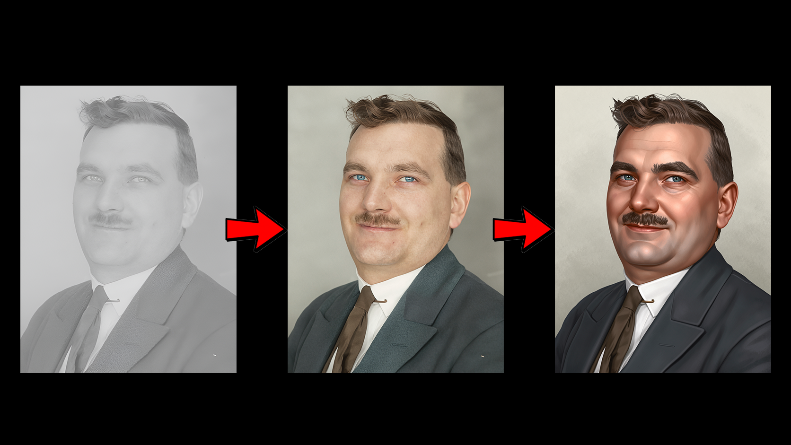
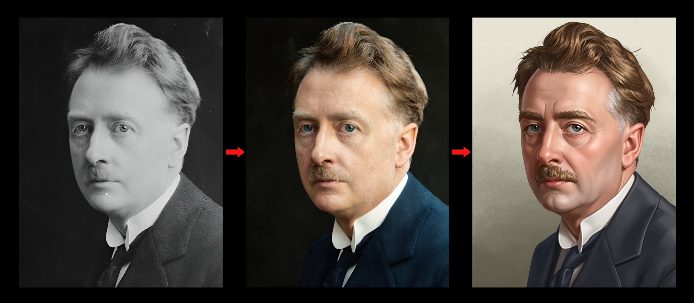
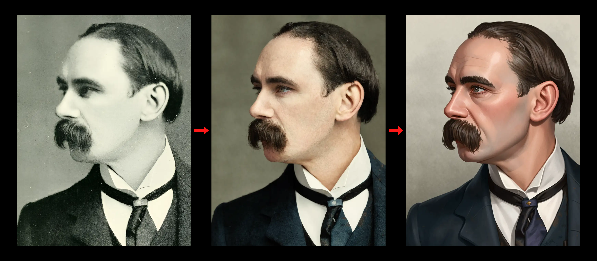
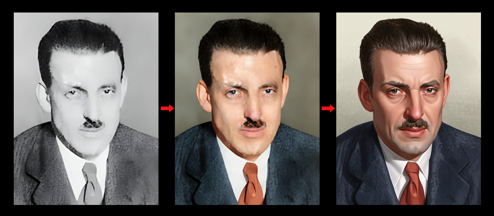
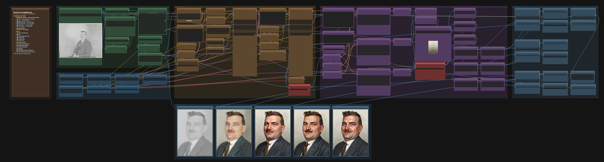
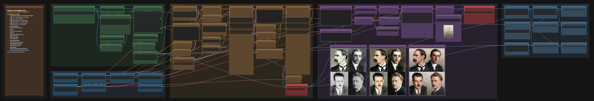
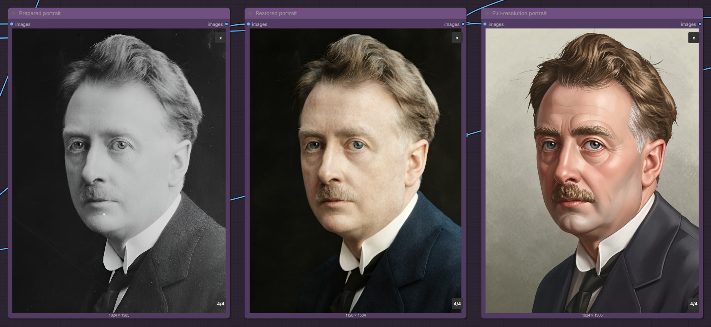

# HOI4 portraits with FLUX.2 Klein 9B

[](LICENSE) [](https://huggingface.co/Hoops-McCann/hoi4-portraits-flux2-klein-9b-lora) [](https://discord.gg/rAXesGcT2t) [](https://ko-fi.com/klimpaskov)

Create Hearts of Iron IV-style leader portraits with ComfyUI and the FLUX.2 Klein 9B distilled model plus the project's HOI4 style LoRA. The source workflow keeps the person's crop, pose, framing, and facial identity anchored, restores old photos, and styles three portrait candidates for comparison. The batch workflow turns a whole folder of photos into game-ready portraits in one queue.

The same workflows open locally, on RunPod, and in Comfy Cloud. RunPod defaults to FP8, while the Windows installer uses GPU detection to recommend a suitable model; GGUF and full BF16 remain available as manual selections. Every workflow saves **HOI4-ready 156×210 DDS files** for a mod's `gfx/leaders/TAG/` folder.

## Portrait results

Each comparison shows the original portrait, the restored portrait, and the final HOI4-style result.










## Four workflows

| Workflow | Best for | What it runs |
| --- | --- | --- |
| [`hoi4_portrait_source.json`](workflows/hoi4_portrait_source.json) | Identity-preserving portrait from a photo | RealESRGAN → Adonis Base + Post restoration → **three** HOI4 LoRA candidates |
| [`hoi4_portrait_text_to_image.json`](workflows/hoi4_portrait_text_to_image.json) | Fictional portrait without a photo | One HOI4 LoRA generation from a text prompt |
| [`hoi4_portrait_batch.json`](workflows/hoi4_portrait_batch.json) | Many photos at once | Processes every input one by one, with configurable candidates and optional background replacement |
| [`hoi4_portrait_processing_only.json`](workflows/hoi4_portrait_processing_only.json) | Clean a source photo before styling | Crop → RealESRGAN → Adonis Base + Post restoration, no style LoRA |

On RunPod, drop batch sources into `/workspace/hoi4-portrait-runpod/input/`. Every workflow saves into:

```text
/workspace/hoi4-portrait-runpod/output/1024x1365/                       full-res master PNG
/workspace/hoi4-portrait-runpod/output/1024x1365/processed/             prepared source PNG
/workspace/hoi4-portrait-runpod/output/1024x1365/restored/              restored source PNG
/workspace/hoi4-portrait-runpod/output/1024x1365/<batch_name>/               batch master PNGs
/workspace/hoi4-portrait-runpod/output/1024x1365/<batch_name>/processed/     batch prepared PNGs
/workspace/hoi4-portrait-runpod/output/1024x1365/<batch_name>/restored/      batch restored PNGs
/workspace/hoi4-portrait-runpod/output/156x210/                         game-size PNG
/workspace/hoi4-portrait-runpod/output/156x210/dds/                     HOI4-ready DDS
/workspace/hoi4-portrait-runpod/output/156x210/<batch_name>/                 batch game-size PNGs
/workspace/hoi4-portrait-runpod/output/156x210/<batch_name>/dds/             batch HOI4-ready DDS files
```

The Windows installer defaults to `Documents\hoi4-portraits\input` and `Documents\hoi4-portraits\output`, with choices for ComfyUI-managed folders or custom paths. Manual and Comfy Cloud installs use the same output subfolders under `ComfyUI/output/hoi4_portraits/`.

The RunPod and Windows installers show the total installation time when they finish.

The PNG and DDS nodes save automatically to the portrait output folder selected during installation. Image-based workflows keep the source image stem in every saved file; the three source candidates append `_1`, `_2`, and `_3`. For example, `general_macarthur.jpg` produces PNG and DDS names beginning with `general_macarthur_1` for the first candidate. Text-to-image uses `text_to_image` because it has no source file. Numbered counters prevent overwrites, and the batch folder is rescanned on every queue in stable filename order. `<batch_name>` is configurable; if left blank, each queue automatically uses the next free name: `batch_1`, `batch_2`, and so on. The same name is used under both output resolutions. The batch settings can also keep portraits directly in the standard resolution folders and default to one HOI4 candidate per source.

## Which model do I need?

The installer downloads only the model variant you choose. Minimum storage includes the shared support models and about 2–3 GB of free space.

| Variant | Minimum storage | VRAM |
| --- | --- | --- |
| Full distilled | 34 GB | above 20 GB |
| FP8 distilled | 25 GB | 16–20 GB |
| GGUF Q4_K_M | 21 GB | 8–10 GB |
| GGUF Q5_K_M | 22 GB | 10–14 GB |
| GGUF Q6_K | 23 GB | 12–16 GB |
| GGUF Q8_0 | 25.5 GB | 16+ GB |

Every variant includes Qwen, the VAE, the canonical HOI4 style LoRA, all three Adonis models, RealESRGAN, BiRefNet, and the face detectors. Refine stays installed as the official alternative first pass; the default graph uses Base → Post. Storage and VRAM requirements are documented in [`docs/local-install.md`](docs/local-install.md).

The [latest release](https://github.com/klimPaskov/comfyui-hoi4-portraits/releases/latest) contains:

- a model-free ZIP for manual installs;
- a **Windows x64 installer wizard** that detects the GPU, recommends a suitable model, offers to install the official ComfyUI portable package when ComfyUI is missing, uses the ROCm package for AMD GPUs, lets you pick any model combination, and installs the workflows, custom nodes, and models;
- a **RunPod runtime archive** whose command defaults to FP8 and accepts `--variant full|fp8|gguf` plus `--gguf-quants`.

## Fastest start

### Windows

```powershell
.\HOI4-Portrait-Workflows-1.0.0-windows-x64.exe
```

Accept the FLUX.2 Klein 9B agreement first (see below), then let the wizard detect your GPU and recommend a suitable model. If it cannot find ComfyUI, it asks whether to install the official Windows portable package automatically; an AMD detection selects the ROCm-enabled package. You can decline and provide an existing ComfyUI path. The wizard also lets you choose the batch input and portrait output folders, which default to the local `Documents\hoi4-portraits` workspace. It installs the node packs, copies the workflows and example inputs, and downloads the models. After restarting ComfyUI, open **Workflows → hoi4_portraits** and queue.

### RunPod

Open a Jupyter terminal on the pod and run:

```bash
(
set -euo pipefail
export HF_TOKEN="hf_..."
COMFY_ROOT=/workspace/runpod-slim/ComfyUI
RUNTIME_DIR=/workspace/hoi4-portrait-runpod
test -f "$COMFY_ROOT/main.py" || { echo "ComfyUI not found at $COMFY_ROOT; set COMFY_ROOT to the folder containing main.py."; exit 1; }
mkdir -p "$RUNTIME_DIR"
curl -fsSL "https://github.com/klimPaskov/comfyui-hoi4-portraits/releases/latest/download/HOI4-Portrait-RunPod.tar.gz" | tar -xz -C "$RUNTIME_DIR"
"$RUNTIME_DIR/scripts/install_runpod.sh" "$COMFY_ROOT" --variant fp8
)
```

The RunPod command uses FP8 by default and requires at least 25 GB of storage. Batch sources go in `/workspace/hoi4-portrait-runpod/input/`, and every PNG and DDS is written below `/workspace/hoi4-portrait-runpod/output/`. You can explicitly select full BF16 on a larger GPU or use GGUF on a smaller GPU, for example:

```bash
"$RUNTIME_DIR/scripts/install_runpod.sh" "$COMFY_ROOT" --variant gguf --gguf-quants Q5_K_M
```

When processing is finished, create an archive of the output in the Jupyter terminal, then right-click `output.tar.gz` in the file browser, download it, and extract it on your computer:

```bash
cd /workspace/hoi4-portrait-runpod
tar -czf output.tar.gz output
```

### Manual install

```bash
git clone https://github.com/klimPaskov/comfyui-hoi4-portraits.git
cd comfyui-hoi4-portraits
python scripts/install_workflows.py --comfyui-root /path/to/ComfyUI
python scripts/install_custom_node_packs.py --comfyui-root /path/to/ComfyUI
python scripts/apply_variant.py --comfyui-root /path/to/ComfyUI --variant fp8
python -m pip install -r scripts/requirements-download.txt
python scripts/download_models.py --comfyui-root /path/to/ComfyUI --variant fp8
```

## Hugging Face access

The full and FP8 FLUX.2 Klein files are gated. Before installing, accept the agreement on [`black-forest-labs/FLUX.2-klein-9B`](https://huggingface.co/black-forest-labs/FLUX.2-klein-9B) (and [`...-9b-fp8`](https://huggingface.co/black-forest-labs/FLUX.2-klein-9b-fp8) for the FP8 variant) and create a [read-only Hugging Face token](https://huggingface.co/settings/tokens/new?tokenType=read). The [Hugging Face guide](docs/hugging-face.md) shows the complete setup. GGUF files are not gated.

## Workflows

### Source portrait

The workflow is arranged from left to right in clear, colour-coded stages.



1. **Source and ESRGAN:** load the portrait, tune **Face zoom** (`0.90`) and **Preserve hat/headwear**, then compare the prepared result below. The upload node already shows the source, so there is no duplicate preview.
2. **Restoration:** the restoration group fully expands the [`Adonis Base + Post workflow`](https://huggingface.co/n8te0/adonis_flux2klein/blob/main/adonis_post_workflows/Adonis_Base_Post_gguf.json). It keeps the 1.7 MP Lanczos crop, reference conditioning, shared empty latent, fixed seed, six-step control, and Shark options. The prompts retain the original Adonis instructions for JPEG artifacts, halftone patterns, descreening, repeating noise, full-scene detail reconstruction, identity preservation, skin and hair texture, deblurring, and focus correction while removing capture-device and gender assumptions. Monochrome and sepia sources are always colorized with plausible, period-appropriate colours. Adonis Base performs the first generation; its latent feeds both Post reference branches, and Adonis Post performs a second full generation before the final VAE decode. One red **Use Adonis restoration** switch defaults on; turn it off to send the prepared portrait directly to the next stage. When the input and restoration settings are unchanged, the workflow reuses the completed Adonis result.
3. **Style:** three independent candidates use the canonical HOI4 style LoRA at strength `1`. Each candidate uses ComfyUI's standard `KSampler` with CFG `1`, guidance `1`, four steps, Euler, simple scheduling, full denoise, and a seed that randomizes for every generation.
4. **Compare and export:** the comparison row keeps ESRGAN, restoration, and all three full-resolution finals together. One shared background switch applies the same choice to all three portraits after generation. Each lane writes a 1024×1365 PNG, a center-cropped 156×210 PNG, and a unique HOI4-ready DDS. The prepared and restored 1024×1365 portraits are also saved in `processed` and `restored` folders.

### Text to image


Create a fictional portrait without a source image. Describe the subject in the purple prompt node, then use the same background, sizing, PNG, and DDS controls as the other workflows. The default prompt is:

```text
hoi4_portrait style, a soviet soldier with the head of a brown bear wearing a soviet hat, ears still visible. No military uniform decorations.
```

### Batch



Process every supported image in the batch input folder one by one. Choose the number of candidates, optionally replace the background, and save each queue in its own matching full-resolution and game-resolution folders.

### Processing only



Crop, upscale, and optionally restore a portrait without applying the HOI4 style LoRA. Prepared and restored portraits are saved separately at 1024×1365.

## Prompting

Keep the source workflow's default prompt exactly as-is:

```text
make this portrait hoi4_portrait style
```

That phrase already triggers the trained HOI4 look. You can append a short subject description when the model needs help with a specific physical feature or clothing choice.

Don't describe the game, background, lighting, or rendering — the LoRA handles those. For a fictional portrait, edit the subject description in the default text-to-image prompt.

## Guides

- [Getting started](docs/getting-started.md)
- [Hugging Face model access and read-only token](docs/hugging-face.md)
- [Workflow controls and graph structure](docs/workflows.md)
- [Comfy Cloud](docs/comfy-cloud.md)
- [Local and RunPod installation, storage and VRAM requirements](docs/local-install.md)
- [Contributing](CONTRIBUTING.md)
- [Third-party model terms](THIRD_PARTY_LICENSES.md)

## License and trademark

Project-owned code, workflows, documentation, backgrounds, and the published LoRA are MIT licensed; third-party models retain their own terms. The FLUX.2 Klein 9B model is gated and non-commercial; using the MIT-licensed workflow or LoRA does not remove those model restrictions. Hearts of Iron IV is a trademark of Paradox Interactive. This community project is not affiliated with or endorsed by Paradox Interactive.
