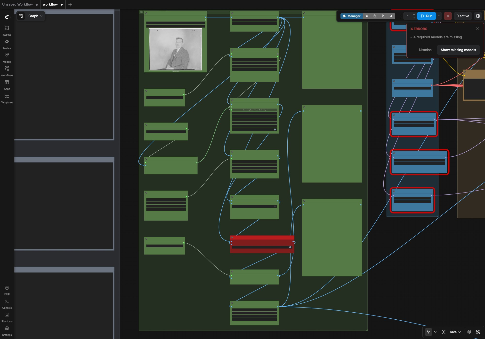
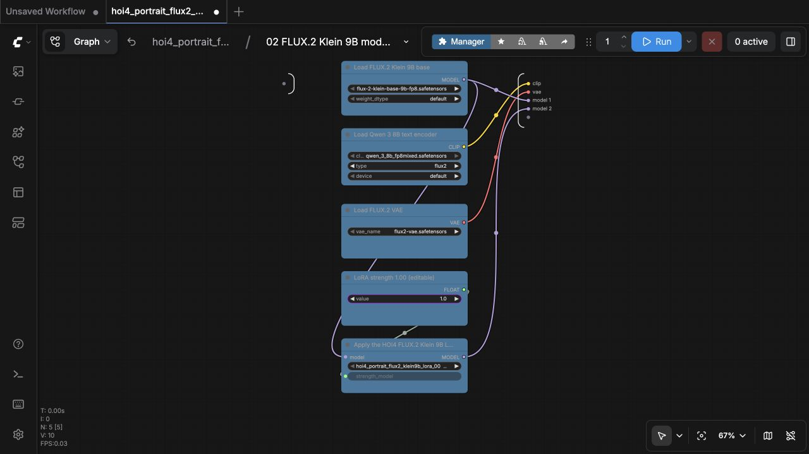
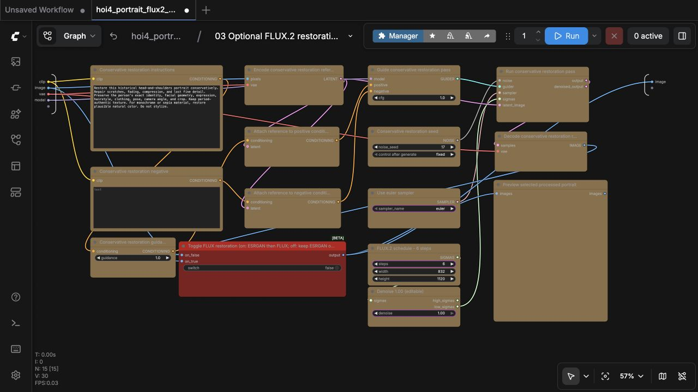
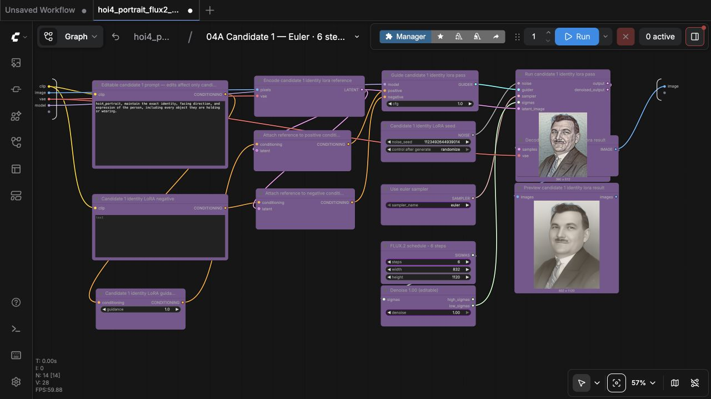
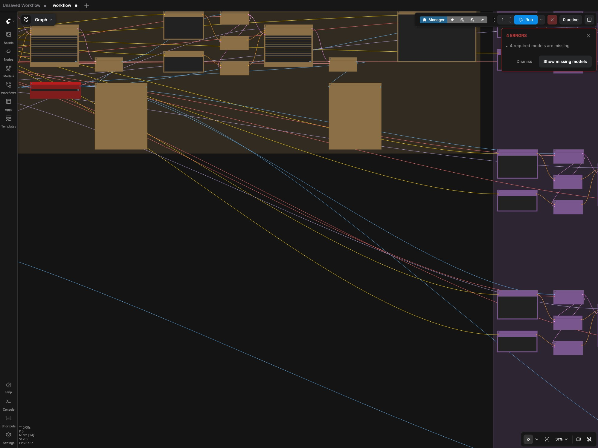
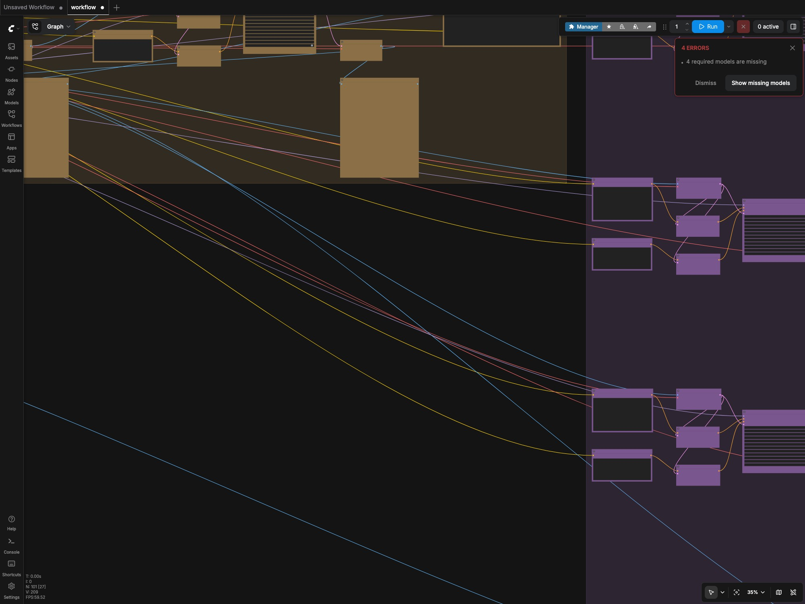
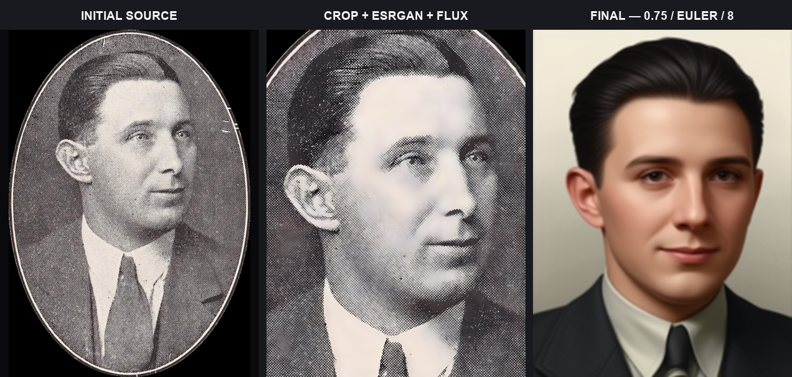
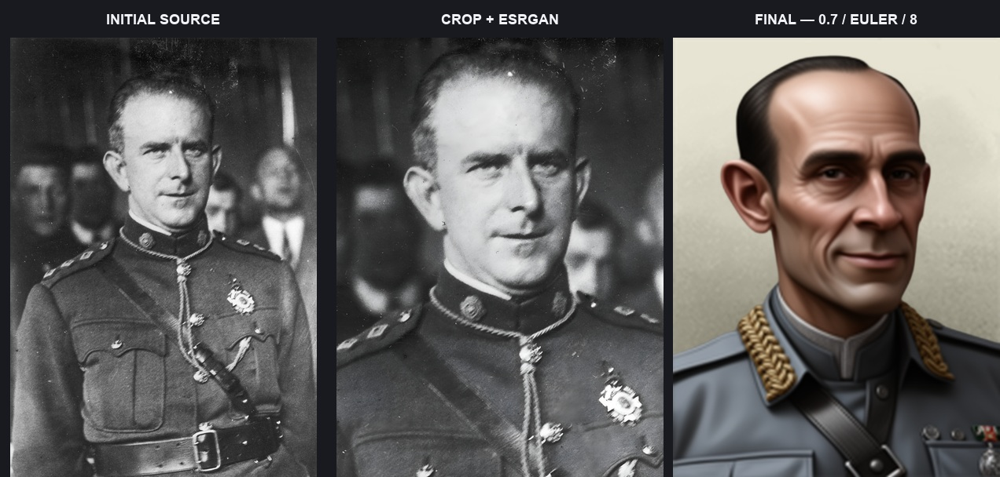
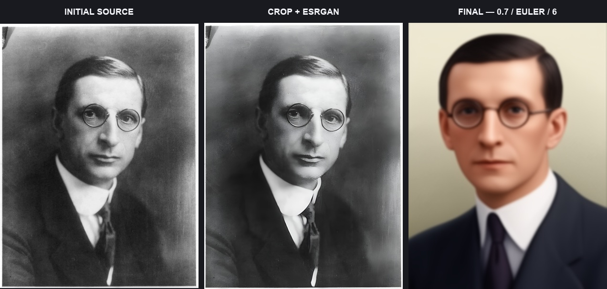
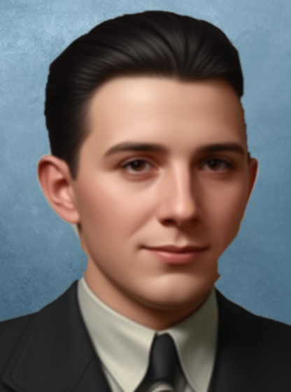

# Identity-preserving HOI4 portraits with FLUX.2 Klein 9B

[](https://github.com/klimPaskov/comfyui-hoi4-portraits/actions/workflows/ci.yml)
[](LICENSE)
[](https://huggingface.co/Hoops-McCann/hoi4-portraits-flux2-klein-9b-lora)

Create identity-preserving Hearts of Iron IV-style leader portraits from source
photographs with ComfyUI. The source workflow keeps the person’s crop, pose,
framing, and facial identity anchored while FLUX.2 Klein 9B prepares and styles
the final portrait.

The same workflow opens locally, on RunPod, and in Comfy Cloud.

## Workflows

| Workflow | Best for | Restoration path |
| --- | --- | --- |
| [`hoi4_portrait_flux2_klein_9b_source`](workflows/hoi4_portrait_flux2_klein_9b_source.json) | Identity-preserving portrait from a source photo | RealESRGAN, optional FLUX.2 restoration, then LoRA styling |
| [`hoi4_portrait_flux2_klein_9b_text_to_image`](workflows/hoi4_portrait_flux2_klein_9b_text_to_image.json) | Fictional portrait without a source photo | No restoration pass |
| [`hoi4_portrait_processing_only`](workflows/hoi4_portrait_processing_only.json) | Prepare a source image before styling | RealESRGAN, then optional FLUX.2 restoration |

Matching [API-format graphs](workflows/) are included for Comfy Cloud MCP,
the Comfy Cloud API, and local `/prompt` submission.

Nine temporary [identity comparison workflows](docs/identity-comparison.md)
are also included for controlled testing of native references, feature
transfer, consistency adapters, RefControl, PuLID, and edit compositing. They
use the same source processing, HOI4 checkpoint, prompts, seeds, and sampler
branches so identity and style strength can be compared fairly.

The [latest GitHub release](https://github.com/klimPaskov/comfyui-hoi4-portraits/releases/latest)
contains a model-free ZIP and a Windows x64 self-extractor.
The Windows executable only unpacks this project; it does not bundle ComfyUI or
model weights.

Krea 2 and Krea Edit variants are available as optional alternatives in the
[Krea workflow release](https://github.com/klimPaskov/comfyui-hoi4-portraits/releases/tag/v1.0.0).
They are separate alternatives; the table above contains the default FLUX.2
workflows.

## Guides

- [Getting started](docs/getting-started.md)
- [Hugging Face model access and read-only token](docs/hugging-face.md)
- [Workflow controls and graph structure](docs/workflows.md)
- [Identity comparison workflows](docs/identity-comparison.md)
- [Comfy Cloud and MCP](docs/comfy-cloud.md)
- [Local and RunPod installation](docs/local-install.md)
- [Local test results and before/afters](docs/test-results.md)
- [Testing](docs/testing.md)
- [Contributing](CONTRIBUTING.md)
- [Third-party model terms](THIRD_PARTY_LICENSES.md)

The installer downloads a gated FLUX.2 model. Before installing, accept the
[FLUX.2 Klein base 9B FP8 agreement](https://huggingface.co/black-forest-labs/FLUX.2-klein-base-9b-fp8)
and create a [read-only Hugging Face token](https://huggingface.co/settings/tokens/new?tokenType=read).
The [Hugging Face guide](docs/hugging-face.md) shows the complete setup.

## What the source workflow does

These screenshots show the source, crop + ESRGAN, optional restoration,
three LoRA candidates, and final portrait checkpoints in the editor layout.
The source workflow opens with FLUX restoration enabled. Queueing the graph
fills its preview nodes with the completed images.

The editor keeps the complete pipeline visible in clearly labeled groups, with
controls and previews placed beside the stage they affect.


### 1. Crop and restore the source

Load the portrait and confirm the automatic head-and-shoulders preview. **Face
zoom** defaults to `0.90`; lower values retain more body. **Preserve
hat/headwear** defaults to `true`; set it to `false` for a normal face-led crop
that may cut oversized headwear. **Toggle face processing** defaults to on. Turn
it off when the full composition—including multiple people—must be retained;
the image still receives a centered 1024 × 1365 crop and RealESRGAN. Use the
manual crop only when selecting one particular person.



### 2. Load FLUX.2 and the portrait LoRA

This group loads FLUX.2 Klein 9B, the Qwen text encoder, VAE, all uploaded
portrait LoRA checkpoints, and the Adonis restoration LoKr. The 2250-step
checkpoint is selected initially; the visible **LoRA strength** controls
default to `1.00`.



### 3. Optionally restore with FLUX.2

The source workflow includes an Adonis-assisted FLUX.2 restoration pass after
ESRGAN. Its red switch opens enabled. Turn it off when the direct ESRGAN result
is preferred.



### 4. Apply the portrait LoRA

The selected processed portrait becomes the reference and starting image for
three independent LoRA styling passes. Each branch uses the processed source
once without an additional identity-preservation method. Each pass
uses a different seed, so one queue produces three candidates from the same
input. Each branch has its own editable identity prompt. Keep its identity text
and add only deliberate
changes, such as `wearing a military hat`, to the candidate you want to test.
Candidate 1 uses Euler with 6 steps, candidate 2 uses `res_2s` with 4 steps,
and candidate 3 uses `res_2m` with 8 steps. All three default to denoise
`1.00`, LoRA strength `1.00`, CFG 1, and FLUX guidance 1.



### 5. Optionally replace the background

Background masking and compositing receive each decoded final portrait. One
shared switch controls all three candidate branches; it is off by default and
runs only after crop, restoration, and LoRA generation. Its red toggle also
opens at `false`.



### 6. Preview and save

Preview all three results, save three 1024 × 1365 master PNGs, and create three
156 × 210 center-cropped game-size portraits. Candidate files use `candidate_1`,
`candidate_2`, and `candidate_3` prefixes under `ComfyUI/output/hoi4_portraits/`.
Lanczos scaling followed by the centered crop removes only a narrow strip from
the sides; it does not stretch the portrait.



Background removal and compositing consume the **decoded final LoRA-styled
images**. They do not run on the source, the ESRGAN image, or the restoration
pass.

Both image-to-image stages start from the encoded processed portrait, not an
empty latent canvas. The styling passes also use doubled reference conditioning
and reference-feature transfer to reduce unwanted identity, pose, and framing
changes.

## Processing workflow

The processing workflow uses the same crop and RealESRGAN preparation as the
source workflow, then offers the same FLUX restoration switch. It stops before
LoRA styling and saves the selected processed image as a 1024 × 1365 master
and a centered 156 × 210 game-size PNG.

## Fastest start: Comfy Cloud

1. For the source or text-to-image workflow, use a Comfy Cloud Creator or Pro
   plan, open **Models → Import**, and import the [2250-step LoRA checkpoint](https://huggingface.co/Hoops-McCann/hoi4-portraits-flux2-klein-9b-lora/blob/main/hoi4_portrait_flux2_klein_9b_lora_000002250.safetensors) as a LoRA. Import `adonis_base.safetensors` when you want the optional restoration pass.
2. Download and open one of the workflow JSON files from the table.
3. For a source workflow, upload a portrait and select it in **Load source portrait**. **Face zoom** defaults to `0.90`; lower it to include more of the body. Leave **Preserve hat/headwear** on to protect the complete hat, or turn it off for a normal face-led crop. Turn off **Toggle face processing** to retain a multi-person composition. Check the processing preview before generating.
4. Upload one of the [`backgrounds/`](backgrounds/) files only if you want background replacement, then enable background replacement.
5. Queue the workflow. A source run creates three candidate portraits. FLUX
   restoration is enabled by default; turn it off to compare the direct ESRGAN
   result.

See [Comfy Cloud setup](docs/comfy-cloud.md) for the exact model-import and MCP
validation flow.

## Experimental: autonomous Comfy Cloud MCP

The MCP path lets an MCP-capable coding agent operate the Cloud workflow from
the source image through installation in a local HOI4 mod. This integration is
experimental. The setup below assumes that you already have:

- a Comfy Cloud **Builder** subscription with Cloud GPU, API, MCP, and custom
  model-import access;
- access to the Comfy Cloud MCP preview;
- the project LoRA imported with the exact filename
  `hoi4_portrait_flux2_klein_9b_lora_000002250.safetensors`;
- an MCP-capable agent with access to this repository and the target mod;
- the mod root, character identifier, output filename, and portrait sprite name
  supplied to the agent. These values are mod-specific and must not be guessed.

### Connect the MCP server

Comfy Cloud hosts the MCP endpoint at `https://cloud.comfy.org/mcp`. In a client
that supports remote OAuth MCP servers, add that URL and complete the Comfy
authorization flow. For API-key clients, create a key at
[`platform.comfy.org/profile/api-keys`](https://platform.comfy.org/profile/api-keys),
then use the official installer:

macOS or Linux:

```bash
curl -fsSL https://raw.githubusercontent.com/Comfy-Org/comfy-cloud-mcp/main/install.sh | bash
```

Windows PowerShell:

```powershell
irm https://raw.githubusercontent.com/Comfy-Org/comfy-cloud-mcp/main/install.ps1 | iex
```

Restart the MCP client after installation. A useful connection check is to ask
the agent to inspect the Comfy Cloud server, find FLUX.2 Klein base 9B and the
imported LoRA, then dry-run the selected `.api.json` graph without submitting a
GPU job.

### What the agent does

With the connection and model import in place, the agent can perform the
portrait job autonomously:

1. Read the appropriate API-format graph from [`workflows/`](workflows/). Use
   source processing with optional FLUX restoration, or processing-only when
   you want an image without LoRA styling.
2. Keep each candidate's identity prompt unchanged unless the request calls
   for a deliberate edit. Append requested features, such as a military hat,
   only to the candidate branch that should test that change.
3. Upload the local source through the MCP file-upload flow. Use the returned
   Cloud filename in **Load source portrait**; a local filesystem path is not a
   valid `LoadImage.image` value in Cloud.
4. Confirm the `0.90` automatic face zoom before processing. The agent should
   exclude printed borders, oval frames, captions, and empty margins while
   keeping the full head, neck, and shoulders.
5. Start with denoise `1.00` and LoRA strength `1.00`, choose whether FLUX restoration is enabled,
   and keep background replacement after the decoded LoRA result. If a custom
   background is requested, upload it separately and replace that loader's
   filename too.
6. Dry-run the modified API graph. Resolve missing nodes, model filenames, or
   invalid input values before submitting any generation.
7. Submit the graph, retain its returned `prompt_id`, and wait for that exact
   job to finish. Queue status alone does not confirm completion.
8. Retrieve and download both the 1024 × 1365 master and centered 156 × 210 game output.
   Visually verify the crop, identity, expression, facial detail, background,
   and absence of frame or vignette artifacts.
9. Copy the approved game portrait into the mod's configured portrait path,
   update the configured `spriteType`/portrait definition and character
   reference when needed, and report the files you edited. Back up existing mod
   files or edit them through version control.

For repeatable autonomous installation, give the agent a small job manifest
instead of relying on prose alone:

```yaml
source_image: /absolute/path/to/source.png
workflow: source
flux_restoration: true
replace_background: true
mod_root: /absolute/path/to/hoi4-mod
portrait_output: gfx/leaders/TAG/leader_name.png
sprite_name: GFX_portrait_TAG_leader_name
character_file: common/characters/TAG_characters.txt
character_id: TAG_leader_name
```

An example request is: “Use Comfy Cloud MCP and the source API workflow to
turn this source into a portrait. Crop to head and shoulders, use the project
LoRA at 1.00, keep FLUX restoration enabled, replace the background only after
the final LoRA image, verify both outputs, and install the 156 × 210 result
according to this manifest.”

The agent should claim success only after the submitted `prompt_id` is complete,
the output is retrieved, and the destination mod files are checked.
Comfy's Cloud API and MCP are experimental and may change.

## Local / RunPod start

FLUX.2 Klein 9B needs an up-to-date ComfyUI and substantial memory. The FP8
workflow is practical on a 24 GB GPU with offloading. An 18 GB GPU may also run
it with more aggressive offloading and a reduced test canvas; 16 GB systems can
run the same kind of reduced-resolution test but will be slower. The upstream
model card's roughly 29 GB figure is a conservative full-resolution/no-offload
guideline. The complete checkpoint set uses 28.20 GB of pinned model files
plus a 0.86 GB PuLID vision weight. A 32 GB RunPod volume is the practical
minimum when downloading every checkpoint; keep generated outputs tidy while
testing.

```bash
git clone https://github.com/klimPaskov/comfyui-hoi4-portraits.git
cd comfyui-hoi4-portraits
python scripts/install_workflows.py --comfyui-root /path/to/ComfyUI
python scripts/download_models.py --comfyui-root /path/to/ComfyUI
```

The FLUX.2 base model is gated. Accept its Hugging Face agreement and run
`hf auth login` (or set `HF_TOKEN`) before the model download command.

For a RunPod ComfyUI template, this command installs the three primary
workflows, nine identity comparisons, their required extensions, bundled
inputs, and all model files in the correct ComfyUI folders. Set `HF_TOKEN` in
the pod environment first so the gated FLUX.2 base can download:

```bash
(
set -euo pipefail
export HF_TOKEN="hf_..."
COMFY_ROOT=/workspace/runpod-slim/ComfyUI
RUNTIME_DIR=/workspace/hoi4-portrait-runpod
test -f "$COMFY_ROOT/main.py" || { echo "ComfyUI not found at $COMFY_ROOT; set COMFY_ROOT to the folder containing main.py."; exit 1; }
mkdir -p "$RUNTIME_DIR"
curl -fsSL "https://github.com/klimPaskov/comfyui-hoi4-portraits/releases/latest/download/HOI4-Portrait-RunPod.tar.gz" | tar -xz -C "$RUNTIME_DIR"
"$RUNTIME_DIR/scripts/install_runpod.sh" "$COMFY_ROOT"
)
```

The installer uses accelerated resumable Hugging Face transfers, checks the
final files against [`models.json`](models.json), and refuses partial or
mismatched downloads. It downloads every uploaded portrait checkpoint so the
same fixed-seed workflow can compare them. It never writes the token to the
repository. Confirm
that `COMFY_ROOT` points to the folder containing
`main.py`; the `runpod-slim` template uses `/workspace/runpod-slim/ComfyUI`.
Start ComfyUI with `scripts/start_runpod.sh`; startup checks the live node and
sampler registry and reports the exact missing component instead of opening a
broken workflow.

Windows users can run the checked-in installer script:

```powershell
.\scripts\install_windows.ps1 -ComfyUIRoot "C:\path\to\ComfyUI"
```

The Windows release executable extracts the same package. Run it from
PowerShell with an empty destination, then follow `docs/local-install.md` in
the extracted folder:

```powershell
.\HOI4-Portrait-Workflows-2.6.1-windows-x64.exe -destination "C:\Users\you\Documents\HOI4-Portrait-Workflows-v2.6.1"
```

## Prompting

The source workflow reads identity, pose, expression, gaze, hair, and clothing
from the reference image. Each candidate has its own editable prompt with this
default:

```text
hoi4_portrait, maintain the exact identity, facing direction, and expression of the person, including every object they are holding or wearing.
```

Keep that identity sentence in place. Add requested changes after it, for
example: `Add a military hat.` Editing one prompt affects only that candidate,
so the three branches can test different instructions in the same run.

The text-to-image workflow has no reference person. Start its prompt with
`hoi4_portrait,` and add a short, general description such as supported
ethnicity or nationality, broad hair or facial hair, and a civilian, military,
or clerical clothing classification. Do not describe the game, visual style,
background, lighting, framing, or rendering.

```text
hoi4_portrait, an Irish man with dark hair and a moustache, wearing a civilian suit.
```

The source workflow uses denoise `1.00`, LoRA strength `1.00`, CFG 1, and FLUX
guidance 1 by default. Its three candidates use Euler/6 steps, `res_2s`/4
steps, and `res_2m`/8 steps.

For monochrome or sepia sources, enable **FLUX restoration** so natural color
is restored before LoRA styling. LoRA strength controls style intensity; it is
not a colorization control.

## Examples

These examples are local runs with the published LoRA. Every source board is
initial source → processed crop → final portrait. Each final panel prints the
settings used for that accepted color run. The examples exclude grayscale
finals, blur, crop failures, and pose drift.

### Source processing with FLUX restoration




### Source processing with restoration disabled






### Post-final background replacement

Background replacement receives the decoded final portrait, so it can be
switched on after LoRA styling. This example uses the bundled scientist
background with a completed FLUX portrait.



### No-input portraits and step control


See [the three random prompts, exact test conditions, and findings](docs/test-results.md).

## Checks

- The three primary workflows and nine identity comparisons are generated with
  matching API graphs from one deterministic source.
- Link endpoints, slot types, output nodes, visual groups, and node geometry are tested.
- Node and group overlap checks pass with spacing margins.
- Comfy Cloud MCP no-spend preflight passes for the three primary API graphs. The
  project LoRA must be imported into the Cloud model library before generation.
- Cloud GPU mechanical tests pass every workflow shape and the final
  background path with a compatible catalog LoRA at zero strength.
- Local functional evidence covers three source portraits with restoration,
  three source portraits with restoration disabled, three text-to-image
  portraits, and fixed-seed 6/8/10/12/20/35-step controls. The gallery boards
  with their settings printed on each board.

Run the same checks locally:

```bash
python scripts/build_workflows.py
python scripts/validate_workflows.py
python -m unittest discover -s tests -v
```

## License and trademark

Project-owned code, workflows, documentation, backgrounds, and the published
LoRA are MIT licensed; third-party models retain their own terms. The FLUX.2
Klein 9B base model is gated and non-commercial; using the MIT-licensed
workflow or LoRA does not remove those model restrictions. Hearts of Iron IV
is a trademark of Paradox Interactive. This community project is not
affiliated with or endorsed by Paradox Interactive.
