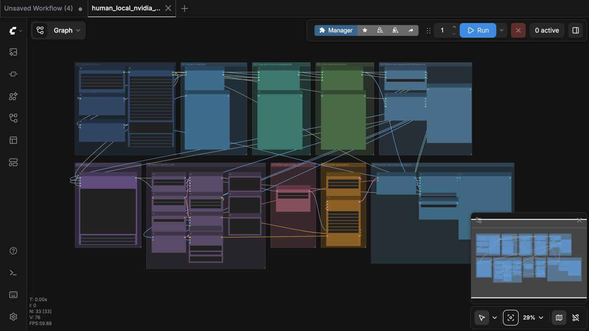
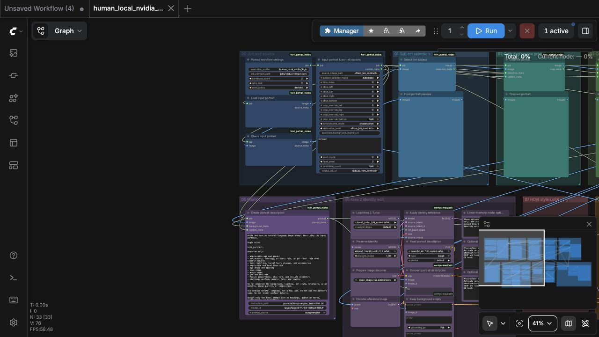
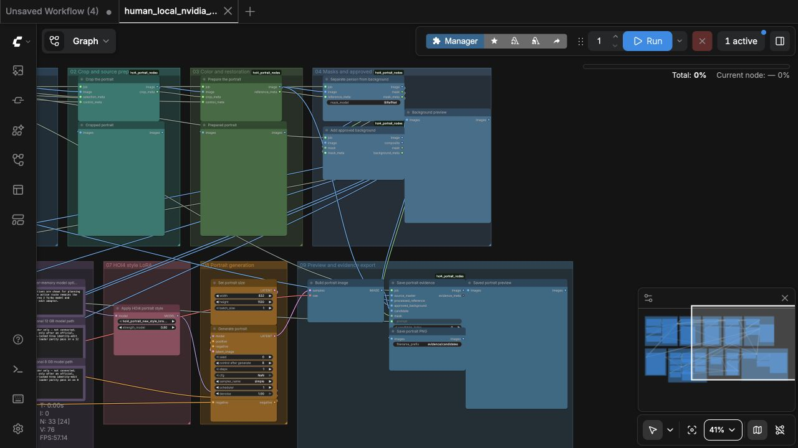
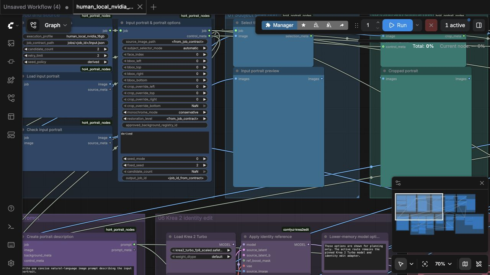
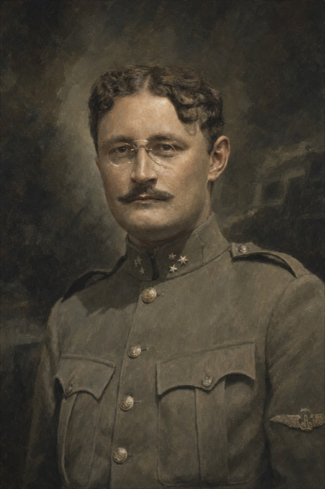
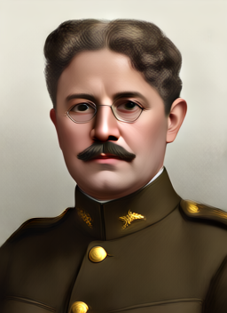
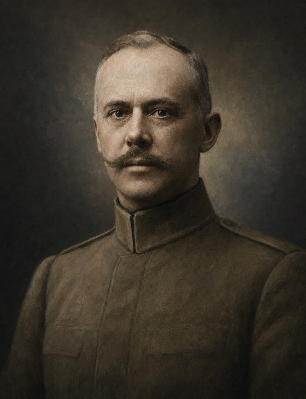
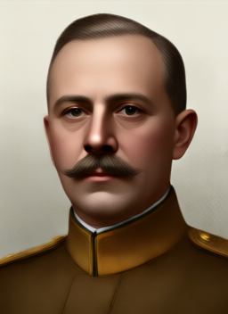
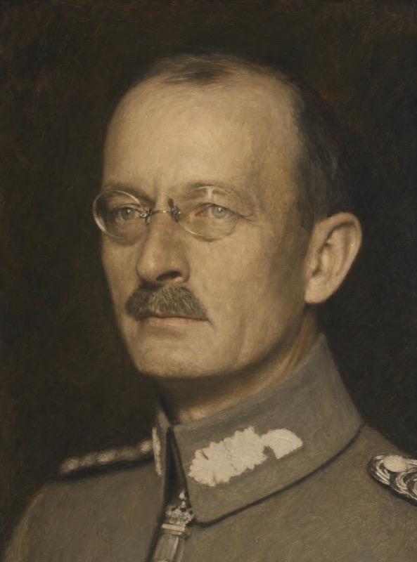
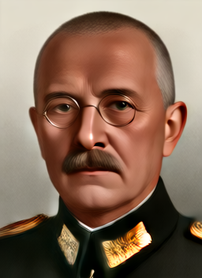

# HOI4 Portrait Workflows for ComfyUI

Identity-preserving Krea 2 Turbo workflows for turning historical portraits into Hearts of Iron IV-style leader art. The repository supplies the workflows, custom nodes, pinned dependency manifests, automated installer, audit guards, and examples. ComfyUI and model weights are installed separately.

## Workflows

| Workflow | Use | Prompt source |
| --- | --- | --- |
| [`human_local_nvidia_16gb`](workflows/human/local_nvidia_16gb/human_local_nvidia_16gb.json) | 12–16 GB NVIDIA GPU | Built-in portrait autoprompter |
| [`agent_local_nvidia_16gb`](workflows/agent/local_nvidia_16gb/agent_local_nvidia_16gb.json) | 12–16 GB NVIDIA GPU | Job contract |
| [`human_full_power_gpu`](workflows/human/full_power_gpu/human_full_power_gpu.json) | RunPod GPU | Built-in portrait autoprompter |
| [`agent_full_power_gpu`](workflows/agent/full_power_gpu/agent_full_power_gpu.json) | RunPod GPU | Job contract |

Human workflows include large previews for the source, crop, prepared reference, approved background, and final saved image. Agent workflows contain no autoprompter.

## Install

1. Install current ComfyUI with an NVIDIA-supported PyTorch build.
2. Clone this repository.
3. Optionally set `HF_TOKEN` to avoid anonymous Hugging Face rate limits.
4. Run the installer from PowerShell:

```powershell
.\scripts\install_windows.ps1 `
  -ComfyUIRoot "C:\path\to\ComfyUI" `
  -Profile local_nvidia_16gb
```

The installer does not replace ComfyUI. It verifies pinned revisions and checksums, installs the Krea Edit and project node packs, restores the required models, registers model paths, and copies all four workflows.

Start the required loopback services and ComfyUI:

```powershell
.\scripts\start_windows.ps1 `
  -ComfyUIRoot "C:\path\to\ComfyUI" `
  -Workflow human_local_nvidia_16gb
```

If the local profile is not feasible, use the [RunPod setup](docs/runpod.md) with `full_power_gpu`.

## One-command RunPod setup

Create a private RunPod Pod with ComfyUI already installed, open its terminal, and paste:

```bash
bash -lc 'set -e; P=/workspace/comfyui-hoi4-portraits; test -d "$P/.git" || git clone https://github.com/klimPaskov/comfyui-hoi4-portraits.git "$P"; "$P/scripts/install_runpod.sh" /workspace/ComfyUI'
```

That command installs the checksum-locked sidecar dependencies, pinned Krea Edit nodes, Krea model, encoder, VAE, identity adapter, style LoRA, preprocessing models, and full-power autoprompter model. It registers the model folders and installs only `human_full_power_gpu` in RunPod.

Then start the human full-power profile:

```bash
/workspace/comfyui-hoi4-portraits/scripts/start_runpod.sh /workspace/ComfyUI
```

ComfyUI stays on loopback. Access it through an authenticated SSH tunnel. See the [full RunPod walkthrough](docs/runpod.md), including folder mappings and troubleshooting.

## Workflow









## Before and after

These are real 256×352, two-step smoke-test outputs from the human workflow. They prove the route executes; they are not quality benchmarks or auditor-approved production portraits.

| Before | After |
| --- | --- |
|  |  |
|  |  |
|  |  |

## Safety and acceptance

The graph uses Krea identity editing, not face swapping. ControlNet is intentionally omitted because no approved experiment showed an identity or geometry benefit over the existing identity-reference, mask, and background controls.

Generation is not final acceptance. The project blocks final PNG/DDS and mod wiring until the separate auditor passes identity, geometry, expression, accessories, masks, style, and provenance.

See [Getting started](docs/getting-started.md), [Workflow guide](docs/workflows.md), and [Testing status](docs/testing-and-evidence.md).
