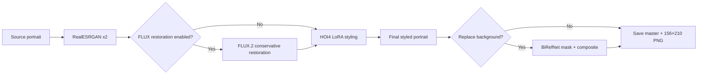

# HOI4 portraits with FLUX.2 Klein 9B

[](https://github.com/klimPaskov/comfyui-hoi4-portraits/actions/workflows/ci.yml)
[](LICENSE)
[](https://huggingface.co/Hoops-McCann/hoi4-portraits-flux2-klein-9b-lora)

Clean ComfyUI workflows for turning portrait photographs—or a written
character description—into Hearts of Iron IV-style leader portraits. The
default model stack is **FLUX.2 Klein base 9B** plus the project’s newly
trained `hoi4_portrait` LoRA.

The current workflows use built-in ComfyUI nodes only. There is no project
custom-node pack, no Krea dependency, and no hidden sidecar service, so the
same graphs can be opened locally or in Comfy Cloud.

## Workflows

| Workflow | Best for | Restoration path |
| --- | --- | --- |
| [`hoi4_portrait_flux2_klein_9b_full_power`](workflows/hoi4_portrait_flux2_klein_9b_full_power.json) | Best source-photo quality; 32 GB+ GPU or Comfy Cloud | RealESRGAN first, then switchable FLUX.2 restoration |
| [`hoi4_portrait_flux2_klein_9b_esrgan_only`](workflows/hoi4_portrait_flux2_klein_9b_esrgan_only.json) | Faster source-photo conversion | RealESRGAN only, then FLUX.2 LoRA styling |
| [`hoi4_portrait_flux2_klein_9b_text_to_image`](workflows/hoi4_portrait_flux2_klein_9b_text_to_image.json) | Creating a fictional leader without a source image | No restoration pass |

Matching [API-format graphs](workflows/) are included for Comfy Cloud MCP,
the Comfy Cloud API, and local `/prompt` submission.

The earlier Krea 2 and Krea Edit workflows are kept only as an alternative in
the archived [v1.0.0 release](https://github.com/klimPaskov/comfyui-hoi4-portraits/releases/tag/v1.0.0).
They are intentionally excluded from the default workflow table and current
package.

## What the full workflow does



Background removal and compositing consume the **decoded final LoRA-styled
image**. They do not run on the source, the ESRGAN image, or the restoration
pass.

## Fastest start: Comfy Cloud

1. In Comfy Cloud, open **Models → Import** and import the [public LoRA file](https://huggingface.co/Hoops-McCann/hoi4-portraits-flux2-klein-9b-lora/blob/main/hoi4_portraits_flux2_klein_9b_lora_000002500.safetensors) as a LoRA.
2. Download and open one of the workflow JSON files from the table.
3. For a source workflow, upload a head-and-shoulders photograph and select it in **Load source portrait**.
4. Upload one of the [`backgrounds/`](backgrounds/) files only if you want background replacement, then turn on the final background switch.
5. Queue the workflow. In full power, turn **Toggle FLUX restoration** off to run ESRGAN-only without rewiring anything.

See [Comfy Cloud setup](docs/comfy-cloud.md) for the exact model-import and MCP
validation flow.

## Local / RunPod start

FLUX.2 Klein 9B needs an up-to-date ComfyUI and substantial memory. Its
upstream model card says the base fits in roughly 29 GB VRAM, so a 32 GB GPU is
the practical local target. Lower-memory systems may require model offloading
and will be slow. The model files use about 19 GB of disk before ComfyUI caches
or outputs.

```bash
git clone https://github.com/klimPaskov/comfyui-hoi4-portraits.git
cd comfyui-hoi4-portraits
python scripts/install_workflows.py --comfyui-root /path/to/ComfyUI
python scripts/download_models.py --comfyui-root /path/to/ComfyUI
```

The FLUX.2 base model is gated. Accept its Hugging Face agreement and run
`hf auth login` (or set `HF_TOKEN`) before the model download command.

For a RunPod ComfyUI template:

```bash
bash -lc 'P=/workspace/comfyui-hoi4-portraits; test -d "$P/.git" || git clone https://github.com/klimPaskov/comfyui-hoi4-portraits.git "$P"; "$P/scripts/install_runpod.sh" /workspace/ComfyUI'
```

Windows users can run:

```powershell
.\scripts\install_windows.ps1 -ComfyUIRoot "C:\path\to\ComfyUI"
```

## Prompting

Keep `hoi4_portrait` at the start of the positive prompt. Describe visible,
period-appropriate traits in natural language. For image-to-image use, state
what must not change:

```text
hoi4_portrait, transform the supplied person into a polished Hearts of Iron IV leader portrait. Preserve exact identity, facial geometry, expression, hairstyle, visible clothing, pose, camera angle, and crop. Use a hand-painted 1930s-1940s grand-strategy portrait finish, restrained brushwork, realistic skin, crisp eyes, soft directional studio light, muted historical colors, and a formal head-and-shoulders composition.
```

See [autoprompter examples](docs/autoprompter-examples.md) for real prompts
produced by the earlier vision autoprompter and expanded FLUX.2-ready versions.

## Validation status

- All three editor graphs and API graphs are generated from one deterministic source.
- Link endpoints, slot types, output nodes, visual groups, and node geometry are tested.
- Node and group overlap checks pass with spacing margins.
- Comfy Cloud MCP no-spend preflight passes for all three API graphs.
- A full local inference run is not claimed: this checkout does not contain the gated 9B base model, and the available Mac has 16 GB unified memory. Resource-related inability to execute is documented separately from graph correctness.

Run the same checks locally:

```bash
python scripts/build_workflows.py
python scripts/validate_workflows.py
python -m unittest discover -s tests -v
```

## Guides

- [Getting started](docs/getting-started.md)
- [Workflow controls and graph structure](docs/workflows.md)
- [Comfy Cloud and MCP](docs/comfy-cloud.md)
- [Local and RunPod installation](docs/local-install.md)
- [Autoprompter prompt examples](docs/autoprompter-examples.md)
- [Testing](docs/testing.md)
- [Contributing](CONTRIBUTING.md)
- [Third-party model terms](THIRD_PARTY_LICENSES.md)

## License and trademark

Project-owned code, workflows, documentation, backgrounds, and the published
LoRA are MIT licensed; third-party models retain their own terms. The FLUX.2
Klein 9B base model is gated and non-commercial; using the MIT-licensed
workflow or LoRA does not remove those model restrictions. Hearts of Iron IV
is a trademark of Paradox Interactive. This community project is not
affiliated with or endorsed by Paradox Interactive.
