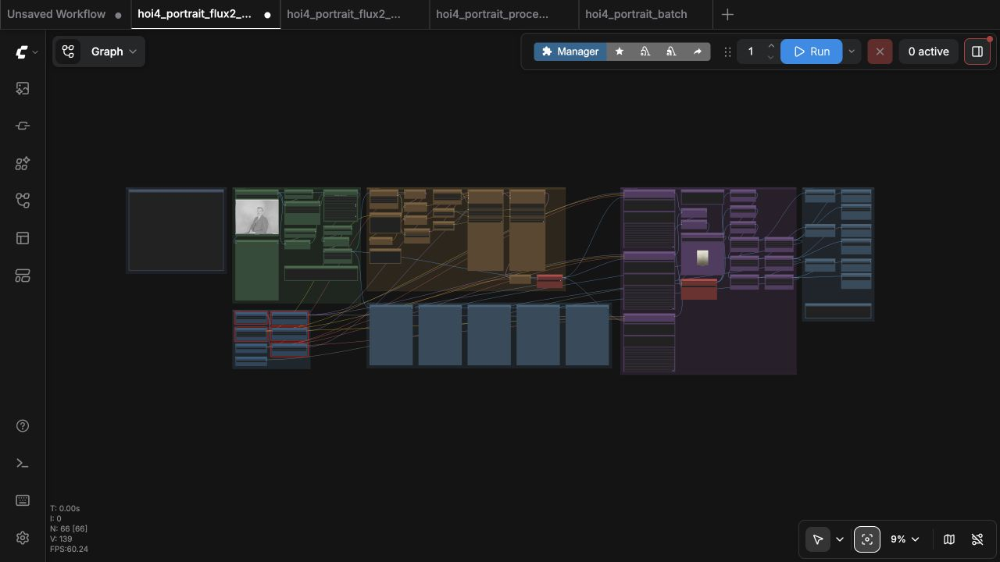
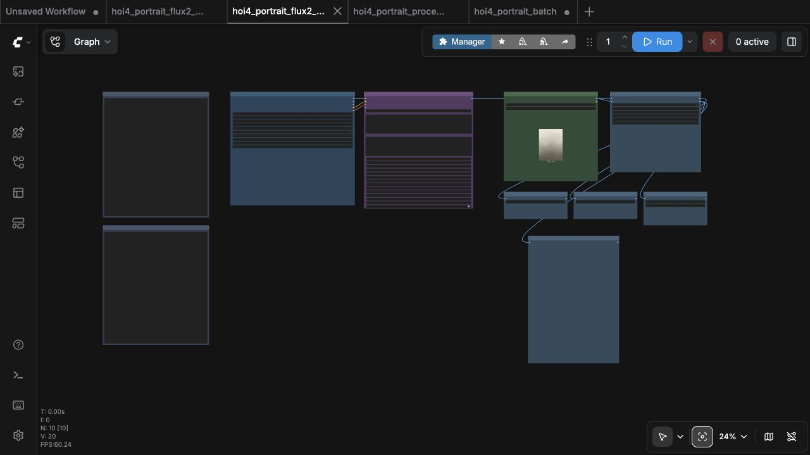
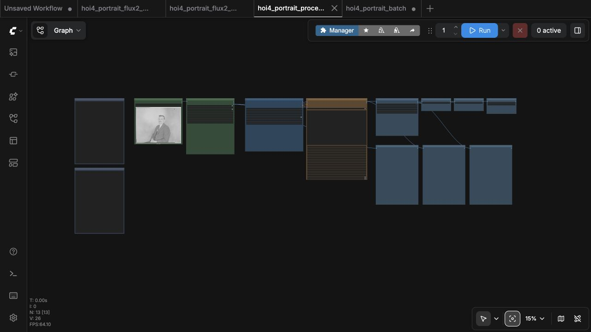
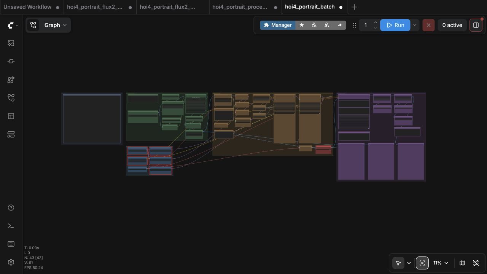

# HOI4 portraits with FLUX.2 Klein 9B

[](LICENSE)
[](https://huggingface.co/Hoops-McCann/hoi4-portraits-flux2-klein-9b-lora)

Create Hearts of Iron IV-style leader portraits with ComfyUI and the FLUX.2
Klein 9B model plus the project's tuned 2500-step LoRA. The source workflow
keeps the person's crop, pose, framing, and facial identity anchored, restores
old photos, and styles three portrait candidates for comparison. The batch
workflow turns a whole folder of photos into game-ready portraits in one
queue.

The same workflows open locally, on RunPod, and in Comfy Cloud. The installers
detect your GPU VRAM and suggest the right model variant (GGUF / FP8 / full),
and every workflow saves **HOI4-ready 156×210 DDS files** for a mod's
`gfx/leaders/TAG/` folder.

## Four workflows

| Workflow | Best for | What it runs |
| --- | --- | --- |
| [`hoi4_portrait_flux2_klein_9b_source.json`](workflows/hoi4_portrait_flux2_klein_9b_source.json) | Identity-preserving portrait from a photo | RealESRGAN → optional Adonis restoration → **three** HOI4 LoRA candidates |
| [`hoi4_portrait_flux2_klein_9b_text_to_image.json`](workflows/hoi4_portrait_flux2_klein_9b_text_to_image.json) | Fictional portrait without a photo | One HOI4 LoRA generation from a text prompt |
| [`hoi4_portrait_processing_only.json`](workflows/hoi4_portrait_processing_only.json) | Clean a source photo before styling | Crop → RealESRGAN → optional Adonis restoration, no LoRA |
| [`hoi4_portrait_batch.json`](workflows/hoi4_portrait_batch.json) | Many photos at once | One sampler processes every image in `input/hoi4_portraits_batch` |

Every workflow saves:

```text
ComfyUI/output/1024x1365/     full-res master PNG
ComfyUI/output/156x210/       game-size PNG
ComfyUI/output/156x210/dds/   HOI4-ready DDS (A8R8G8B8, no mipmaps)
```

## Which model do I need?

The installer downloads only the model variant you choose:

| Variant | File | Download size | VRAM |
| --- | --- | --- | --- |
| Full | `flux-2-klein-9b.safetensors` | 18.2 GB | above 20 GB |
| FP8 | `flux-2-klein-9b-fp8.safetensors` | 9.4 GB | 16–20 GB |
| GGUF | `flux-2-klein-9b-*.gguf` | 5.9–10.0 GB | 8–16 GB |

Shared support files (Qwen 3 8B Q8 GGUF encoder, VAE, LoRA, Adonis Base and
Refine LoKrs, RealESRGAN, BiRefNet, face detectors) add **11.97 GB** on top.
The full install's exact model payload is **30.12 GB (28.05 GiB)**. Storage and VRAM
requirements for each install are documented in
[`docs/local-install.md`](docs/local-install.md).

The [latest release](https://github.com/klimPaskov/comfyui-hoi4-portraits/releases/latest)
contains:

- a model-free ZIP for manual installs;
- a **Windows x64 installer wizard** that detects VRAM, pre-checks the
  recommended variant, lets you pick any combination (including all three),
  asks for GGUF quantizations when GGUF is selected, finds your ComfyUI, and
  installs workflows, custom nodes, and models;
- a **RunPod runtime archive** whose command defaults to the full model and
  accepts `--variant full|fp8|gguf` plus `--gguf-quants`.

## Fastest start

### Windows

```powershell
.\HOI4-Portrait-Workflows-v3.1.0-windows-x64.exe
```

Accept the FLUX.2 Klein 9B agreement first (see below), then let the wizard
detect your VRAM and pre-check the recommended variant. It finds ComfyUI,
installs the node packs, copies the workflows, and downloads the models. After
restarting ComfyUI, open **Workflows → hoi4_portraits** and queue.

### RunPod

```bash
(
set -euo pipefail
export HF_TOKEN="hf_..."
COMFY_ROOT=/workspace/runpod-slim/ComfyUI
RUNTIME_DIR=/workspace/hoi4-portrait-runpod
test -f "$COMFY_ROOT/main.py" || { echo "ComfyUI not found at $COMFY_ROOT; set COMFY_ROOT to the folder containing main.py."; exit 1; }
mkdir -p "$RUNTIME_DIR"
curl -fsSL "https://github.com/klimPaskov/comfyui-hoi4-portraits/releases/latest/download/HOI4-Portrait-RunPod.tar.gz" | tar -xz -C "$RUNTIME_DIR"
"$RUNTIME_DIR/scripts/install_runpod.sh" "$COMFY_ROOT"
)
```

The RunPod command defaults to the full model. For a GPU with limited VRAM,
add the matching flags, for example:

```bash
"$RUNTIME_DIR/scripts/install_runpod.sh" "$COMFY_ROOT" --variant gguf --gguf-quants Q5_K_M
```

### Manual install

```bash
git clone https://github.com/klimPaskov/comfyui-hoi4-portraits.git
cd comfyui-hoi4-portraits
python scripts/install_workflows.py --comfyui-root /path/to/ComfyUI
python scripts/install_custom_node_packs.py --comfyui-root /path/to/ComfyUI
python scripts/apply_variant.py --comfyui-root /path/to/ComfyUI --variant fp8
python scripts/download_models.py --comfyui-root /path/to/ComfyUI --variant fp8
```

## Hugging Face access

The full and FP8 FLUX.2 Klein files are gated. Before installing, accept the
agreement on
[`black-forest-labs/FLUX.2-klein-9B`](https://huggingface.co/black-forest-labs/FLUX.2-klein-9B)
(and [`...-9b-fp8`](https://huggingface.co/black-forest-labs/FLUX.2-klein-9b-fp8)
for the FP8 variant) and create a
[read-only Hugging Face token](https://huggingface.co/settings/tokens/new?tokenType=read).
The [Hugging Face guide](docs/hugging-face.md) shows the complete setup.
GGUF files are not gated.

## What the source workflow does

The workflow is arranged from left to right in clear, colour-coded stages.



1. **Source and ESRGAN:** load the portrait, tune **Face zoom** (`0.90`) and
   **Preserve hat/headwear**, then compare the prepared result below. The
   upload node already shows the source, so there is no duplicate preview.
2. **Restoration:** the restoration group follows the upstream
   [`Adonis_Workflow.json`](https://huggingface.co/n8te0/adonis_flux2klein/blob/main/Adonis_Workflow.json)
   topology: 1.7 MP Lanczos crop, Qwen 3 8B Q8 GGUF, an Adonis Base sampler
   for the first five steps, and an Adonis Refine sampler for the remainder of a nine-step RES4LYF
   schedule. The switch opens enabled; bypass it for a direct ESRGAN input.
3. **Style:** three independent candidates use the exact 2500-step LoRA. Each
   candidate uses ComfyUI's standard `KSampler` with CFG `1`, guidance `1`,
   four steps, Euler, simple scheduling, full denoise, and its own seed.
4. **Compare and export:** the comparison row keeps ESRGAN, restoration, and
   all three finals together. One shared background switch applies the same
   choice to all three portraits after generation.
   Each lane writes a 1024×1365 PNG, a center-cropped 156×210 PNG, and a
   unique 156×210 A8R8G8B8 DDS with no mipmaps.

The other three workflow canvases use the same stage colors and controls:







## Prompting

Keep the source workflow's default prompt exactly as-is:

```text
make this portrait hoi4_portrait style
```

That phrase already triggers the trained HOI4 look. You can safely append a
short description when the model needs help — ethnicity or skin colour if it
gets the skin wrong, or civilian/military/clerical clothing if it helps the
outfit:

```text
make this portrait hoi4_portrait style, a middle-aged Irish man with dark hair, wearing a military uniform
```

Don't describe the game, background, lighting, or rendering — the LoRA handles
those. The text-to-image workflow uses the exact example prompt:

```text
hoi4_portrait style, an Irish middle-aged man with neatly combed dark hair, wearing a plain civilian jacket.
```

## Guides

- [Getting started](docs/getting-started.md)
- [Hugging Face model access and read-only token](docs/hugging-face.md)
- [Workflow controls and graph structure](docs/workflows.md)
- [Comfy Cloud](docs/comfy-cloud.md)
- [Local and RunPod installation, storage and VRAM requirements](docs/local-install.md)
- [Contributing](CONTRIBUTING.md)
- [Third-party model terms](THIRD_PARTY_LICENSES.md)

## License and trademark

Project-owned code, workflows, documentation, backgrounds, and the published
LoRA are MIT licensed; third-party models retain their own terms. The FLUX.2
Klein 9B model is gated and non-commercial; using the MIT-licensed workflow or
LoRA does not remove those model restrictions. Hearts of Iron IV is a
trademark of Paradox Interactive. This community project is not affiliated
with or endorsed by Paradox Interactive.
