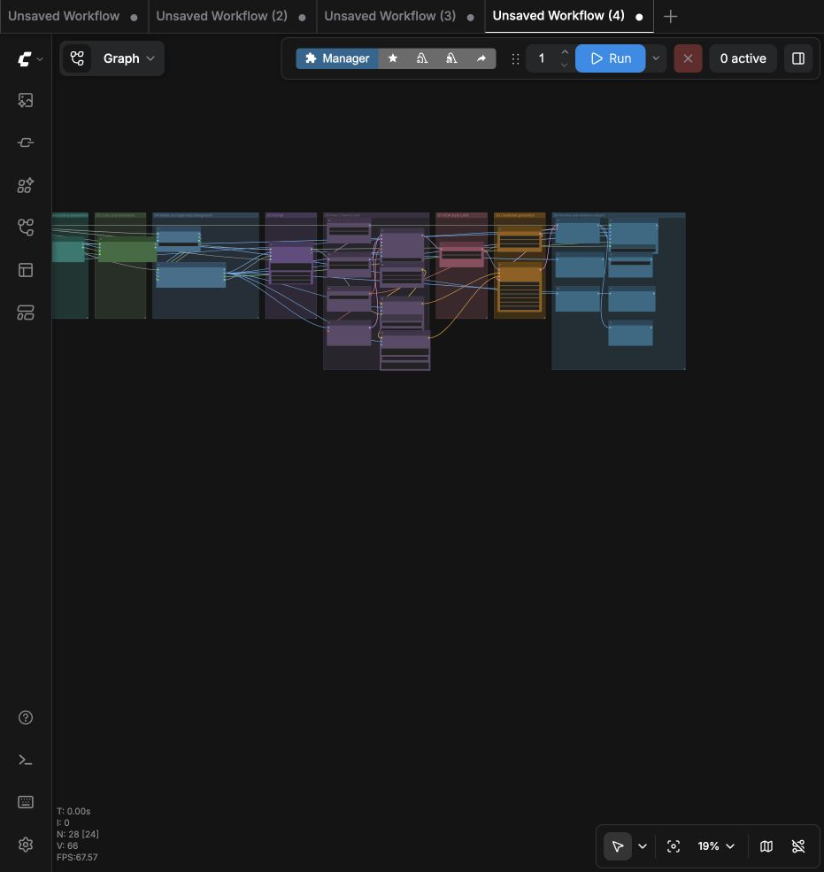
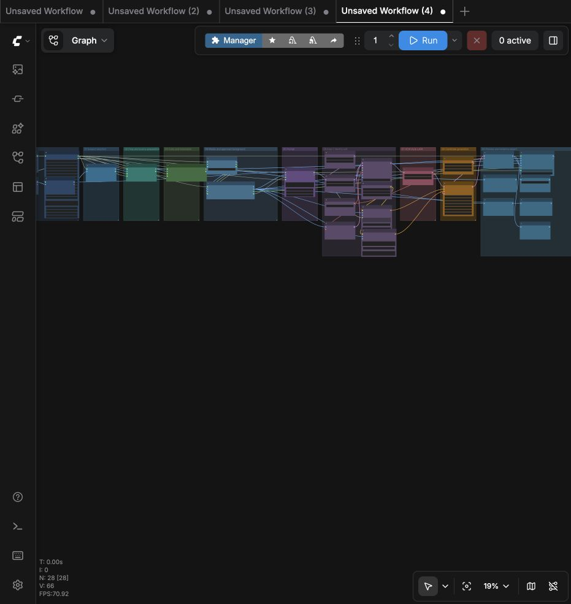
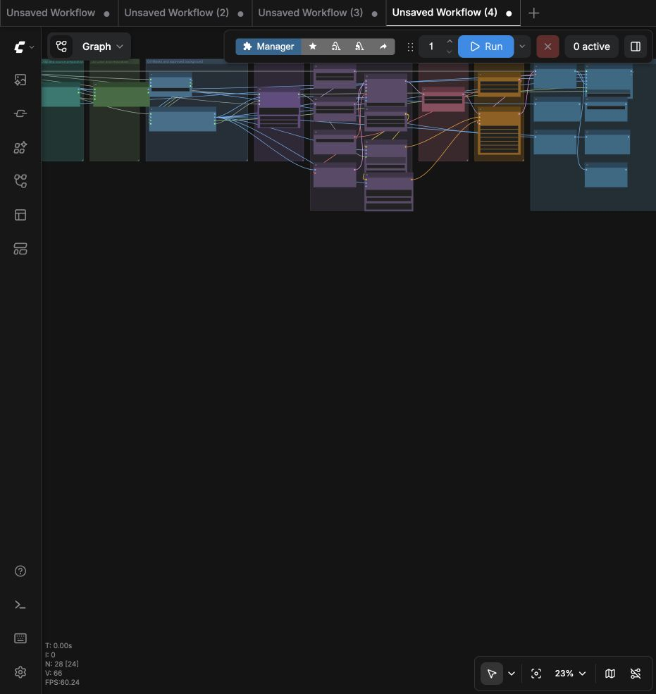
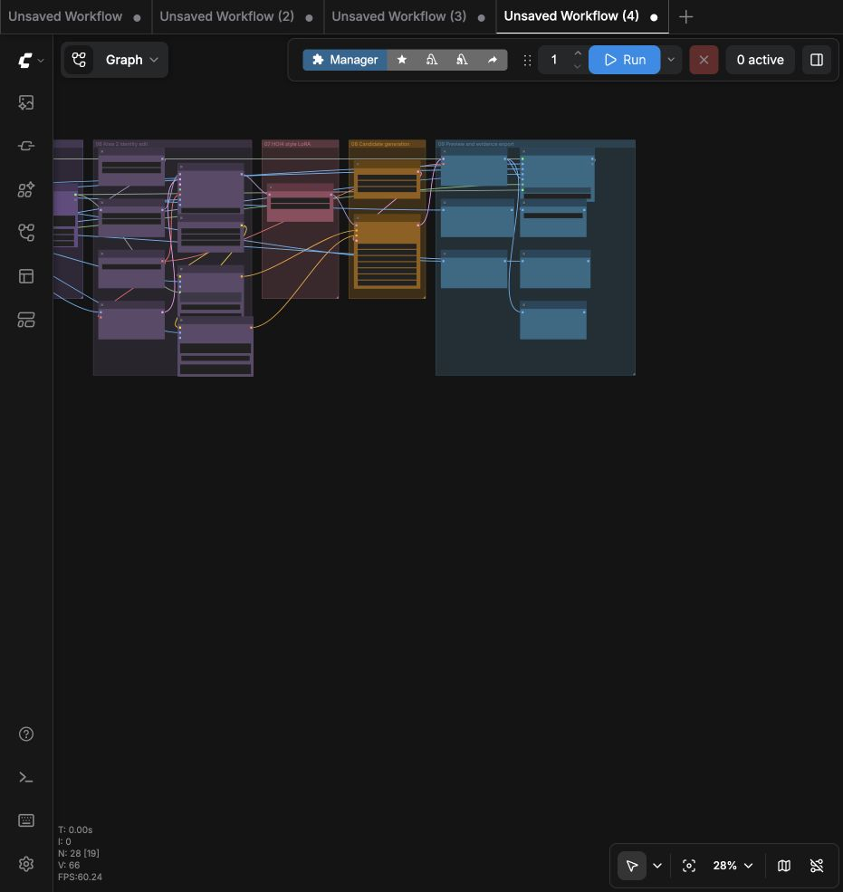
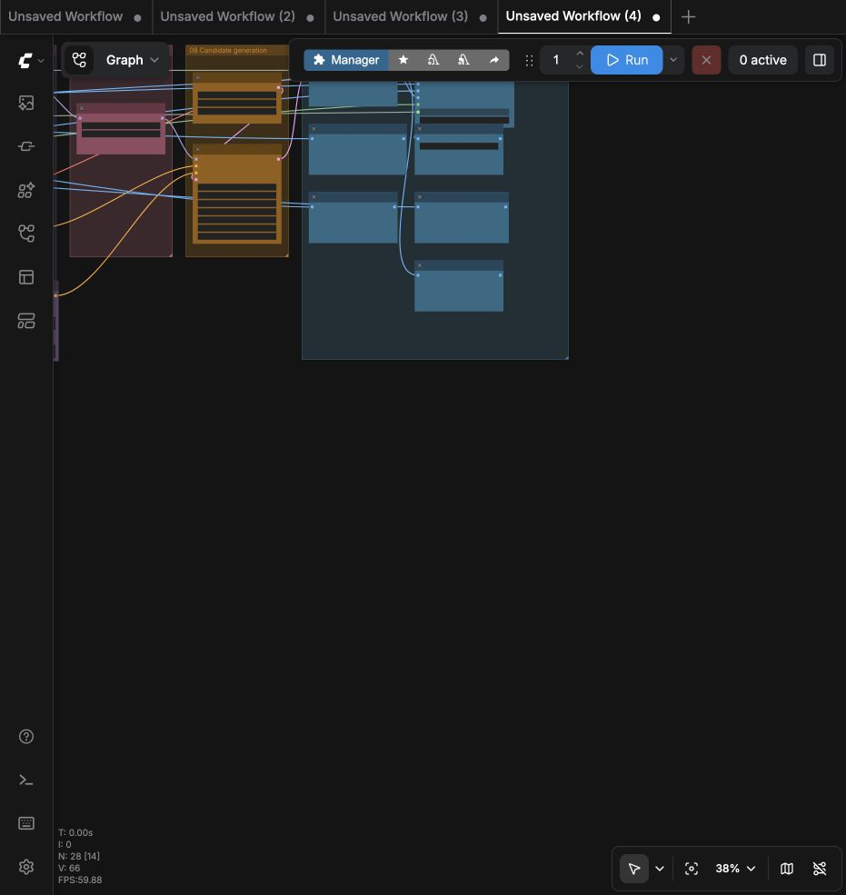
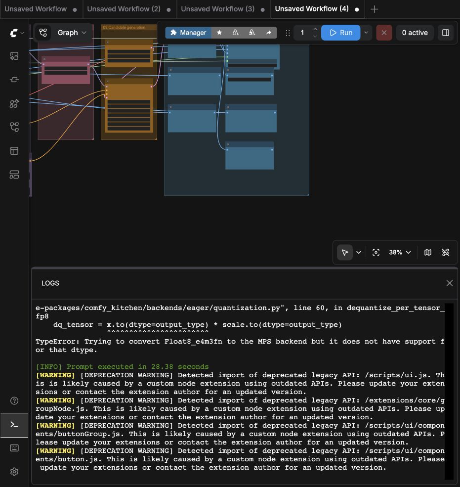
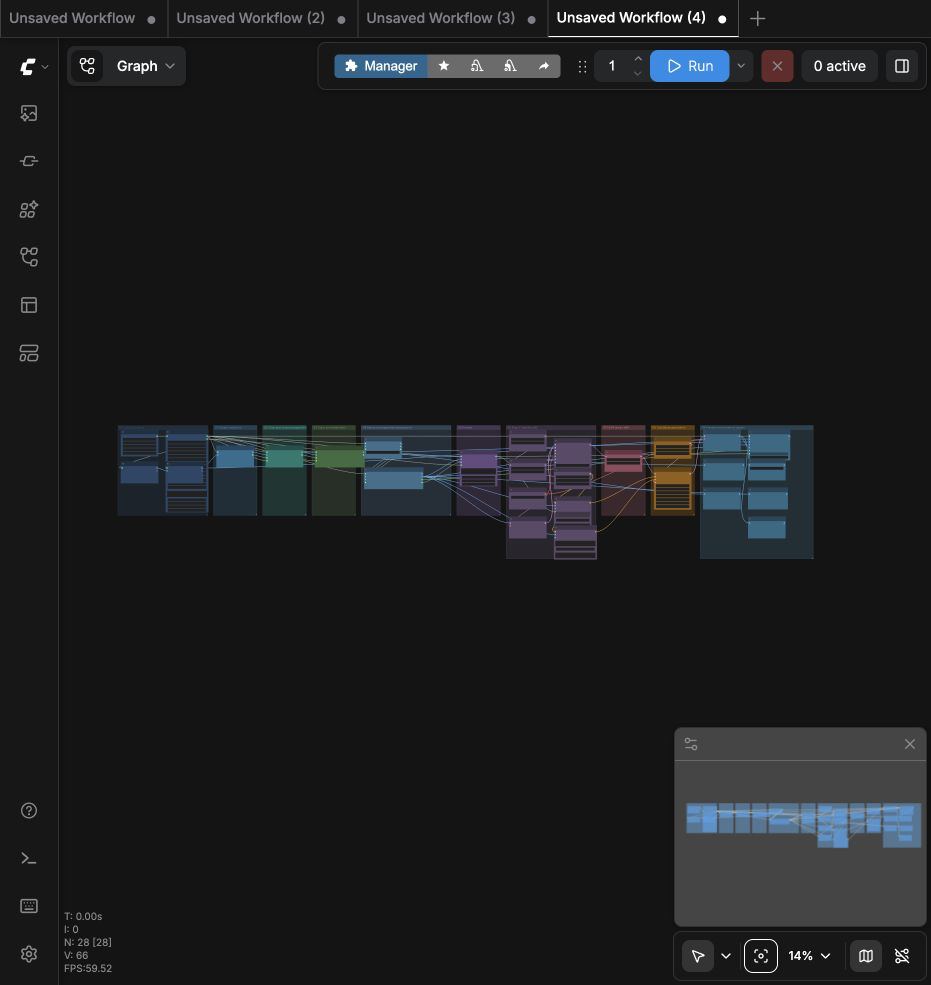
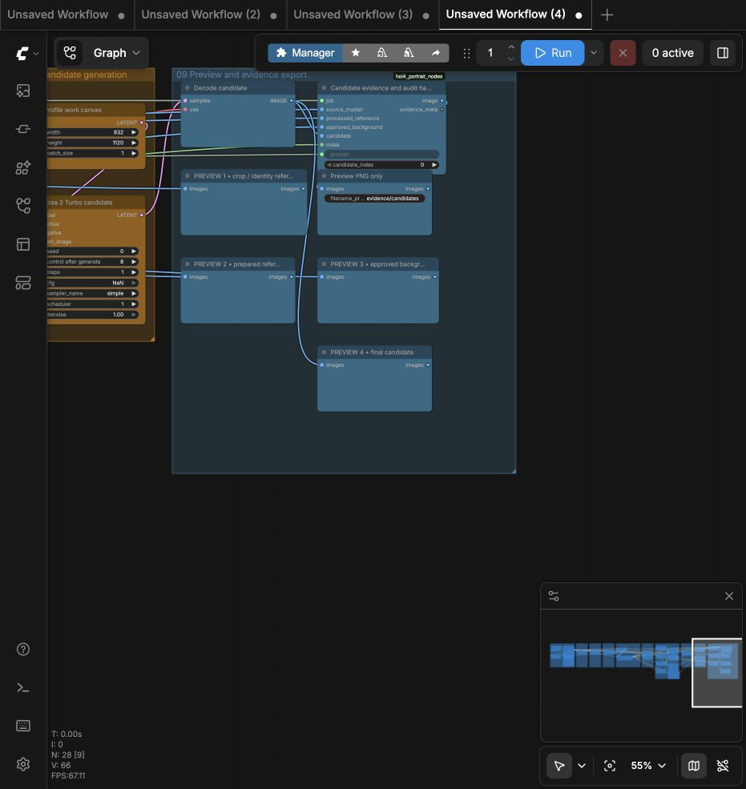

# Screenshots

These images are sanitized public documentation assets. They are not production portrait evidence and contain no source portrait, generated portrait, model weight, or secret.

## Live ComfyUI capture — 2026-07-28

The following UI-only captures were taken from the pinned local `human_local_mac_16gb` graph. They document the actual grouped canvas and the measured local runtime blocker; they do not contain the private input portrait.

The actual source, crop, prepared reference, mask, and background composite from the private qualification run remain under the ignored `jobs/` directory. No generated after portrait was produced: the first run stopped on the MPS FP8 capability error, and the reversible fallback run stopped under the 16 GB memory/offload limit before the first sampler step completed.

*The human local Mac workflow loaded in the pinned ComfyUI editor.*

*The colored stage board includes four human-only preview checkpoints: crop/reference, prepared reference, approved background, and final candidate. In the current graph, the final preview shares the exact image input used by `SaveImage`.*

*A fictional, non-executable example of the job contract shape. The paths and background hash are placeholders.*

*A truthful blocked result: no candidate or final DDS is claimed while production gates are unresolved.*

For authoritative results, use the JSON/Markdown evidence reports linked from [testing and evidence](testing-and-evidence.md).
