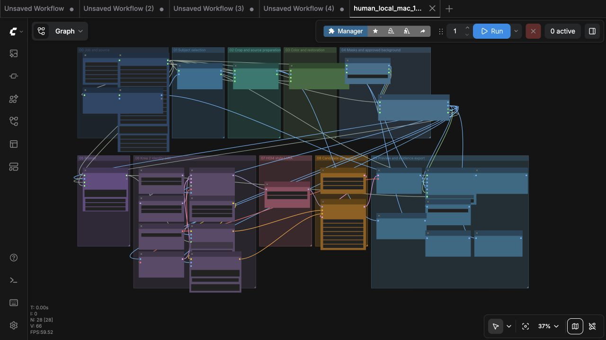
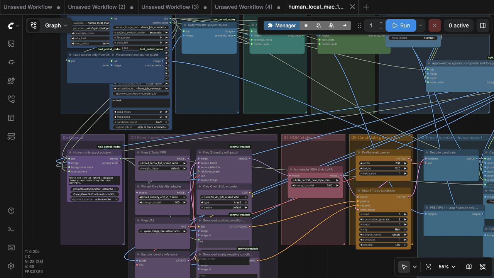
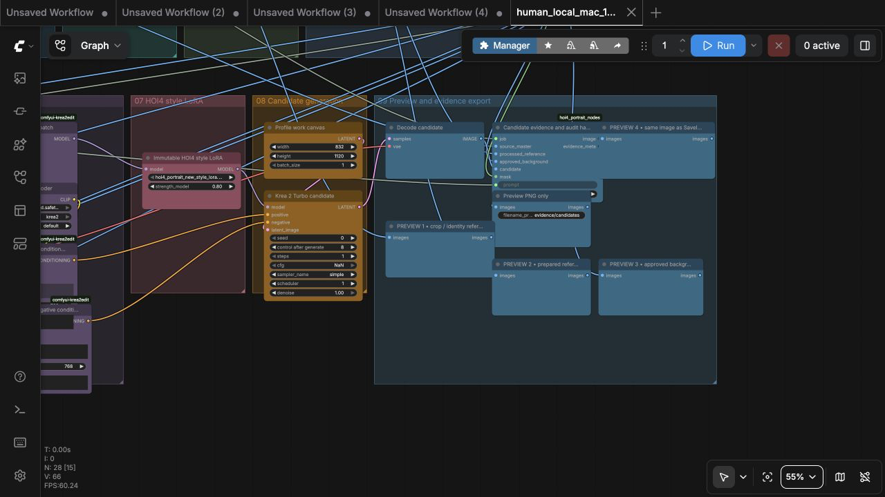
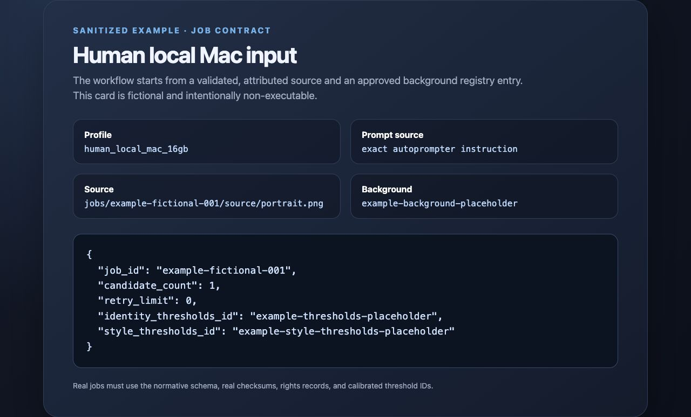
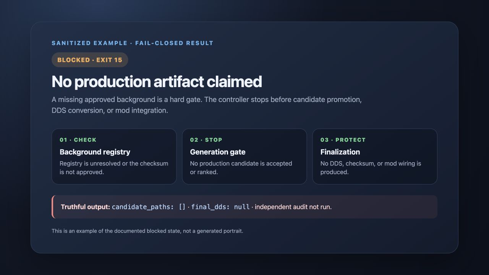

# Screenshots

These images are sanitized public documentation assets. They are not production portrait evidence and contain no source portrait, generated portrait, model weight, or secret.

## Live ComfyUI capture — 2026-07-28

These UI-only captures were taken from the pinned local `human_local_mac_16gb` graph after tightening the canvas into two aligned rows. The overview shows the whole board; the two close-ups are intentionally zoomed so stage names, node labels, and connections can be read. They do not contain the private input portrait.

The actual source, crop, prepared reference, mask, background composite, and private CPU-fallback candidate remain under the ignored `jobs/` directory. The default Apple-MPS route remains blocked; a diagnostic CPU-only NVFP4 run produced a real 832×1120 candidate, but it is not a final or production-approved portrait because the independent audit is `UNCERTAIN` and thresholds are not calibrated.

The colored stage board includes four human-only preview checkpoints: crop/reference, prepared reference, approved background, and final candidate. In the current graph, the final preview shares the exact image input used by `SaveImage`.

*A fictional, non-executable example of the job contract shape. The paths and background hash are placeholders.*

*A truthful blocked result: no candidate or final DDS is claimed while production gates are unresolved.*

For authoritative results, use the JSON/Markdown evidence reports linked from [testing and evidence](testing-and-evidence.md).
