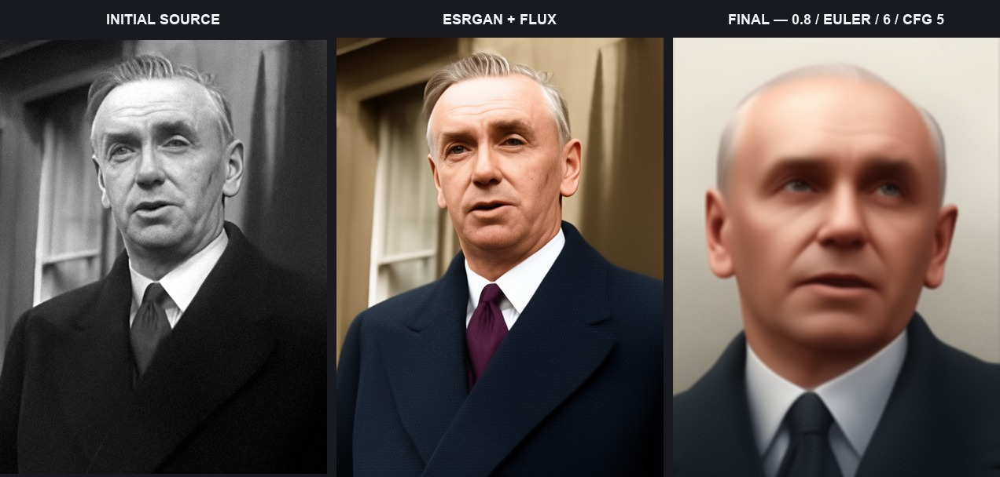
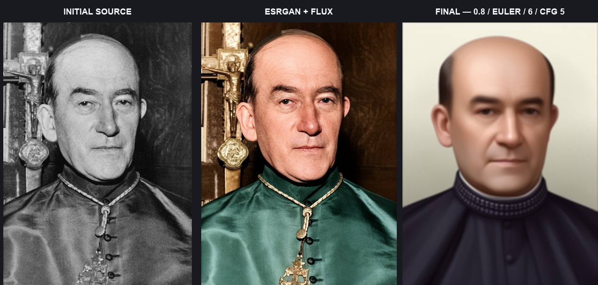
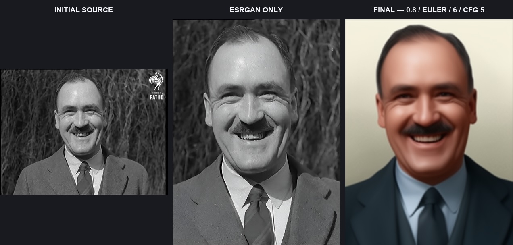
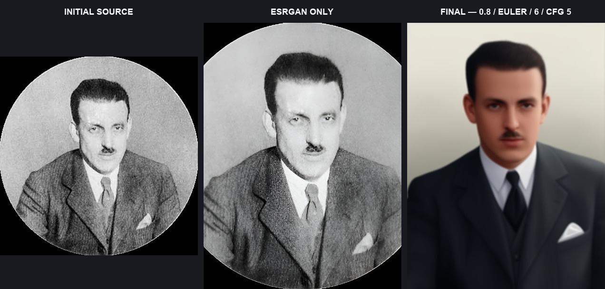
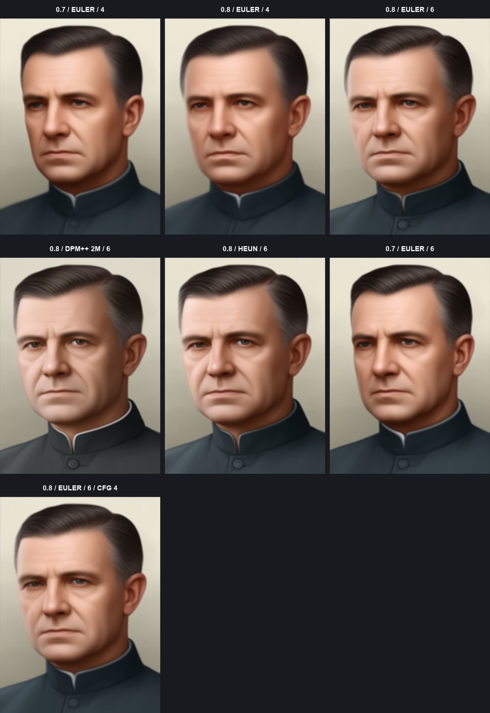

# Local test results

These images were generated locally with the actual FLUX.2 Klein base 9B
stack and `hoi4_portraits_flux2_klein_9b_lora_000002500.safetensors`. The ten
source portraits came from the latest user-supplied `source_originals.zip`,
not older project fixtures.

## Test conditions

- ComfyUI 0.25.0, built-in nodes only;
- Apple-silicon Mac with 16 GB unified memory and MPS low-VRAM offloading;
- 416 × 560 output for the reduced local test;
- final LoRA: strength `0.8`, Euler, six steps, CFG 5;
- full restoration: RealESRGAN first, then a two-step FLUX restoration pass;
- public workflow defaults remain 832 × 1120, Euler, 20 steps, CFG 5.

The six-step finals are functional previews. They can look smoother and lose
small details that the public 20-step preset has more opportunity to resolve.

## Five full-restoration triptychs

Each board shows initial source → RealESRGAN plus FLUX restoration → final
LoRA portrait.

## Five ESRGAN-only triptychs

Each board shows initial source → RealESRGAN preparation → final LoRA
portrait. No FLUX restoration node is evaluated in this path.

## Five no-input portraits

All five were generated from different person-only prompts and recorded
seeds. No prompt requested a game/style, background, lighting, palette, or
rendering treatment.

## LoRA and sampling pilot

The matrix holds prompt, seed, resolution, and CFG constant except for the
explicit CFG-4 control.

Findings from the reduced local pilot:

- `0.8` gives the stronger learned look requested for the default workflow;
- `0.7` is a useful lighter option when identity or source texture matters
  more;
- six steps are more resolved than four, but still below public 20-step
  quality;
- DPM++ 2M did not improve the fixed-seed result over Euler;
- Heun did not improve the result and took longer;
- CFG 4 was slightly softer than CFG 5;
- Euler, 20 steps, CFG 5 remains the public preset and matches ComfyUI's
  native FLUX.2 Klein 9B Base template.

## Post-final background test

The test loaded an already completed LoRA portrait directly into the
background group. Only BiRefNet, the background image scale, mask composite,
and final switch were evaluated. This proves the branch is post-generation.

