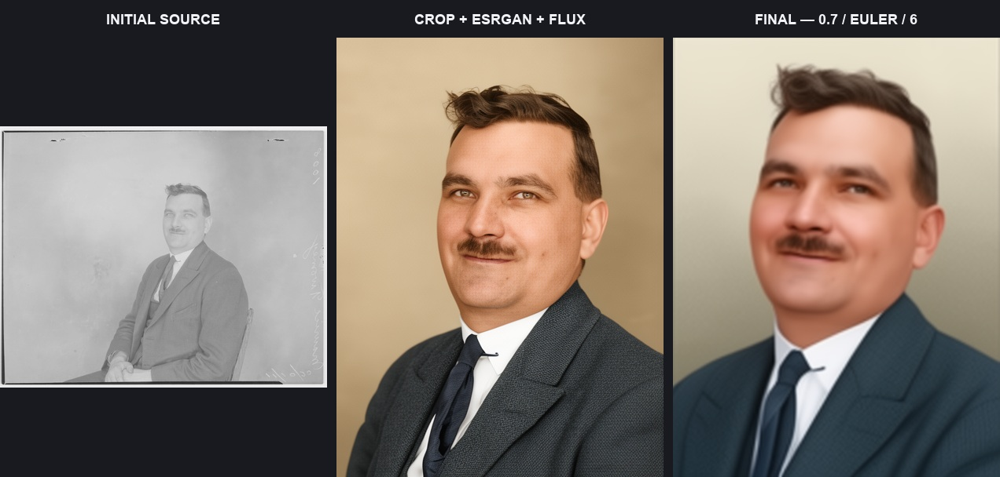
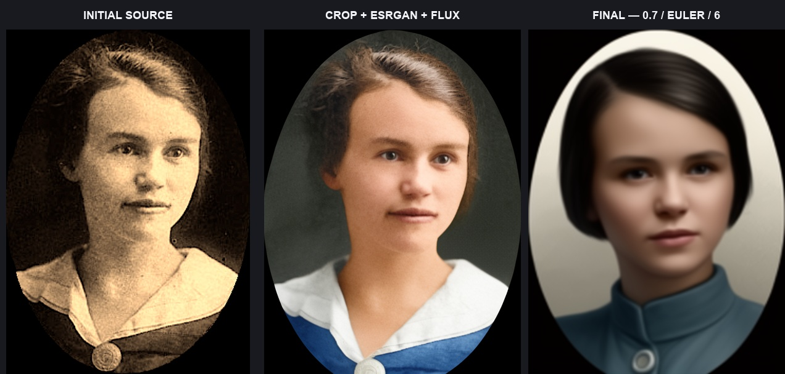
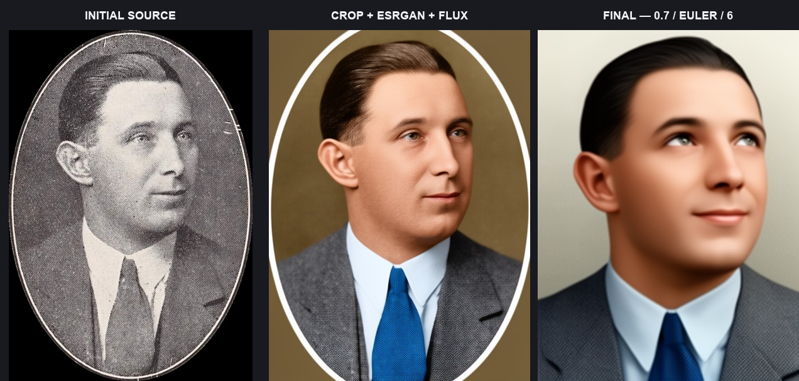
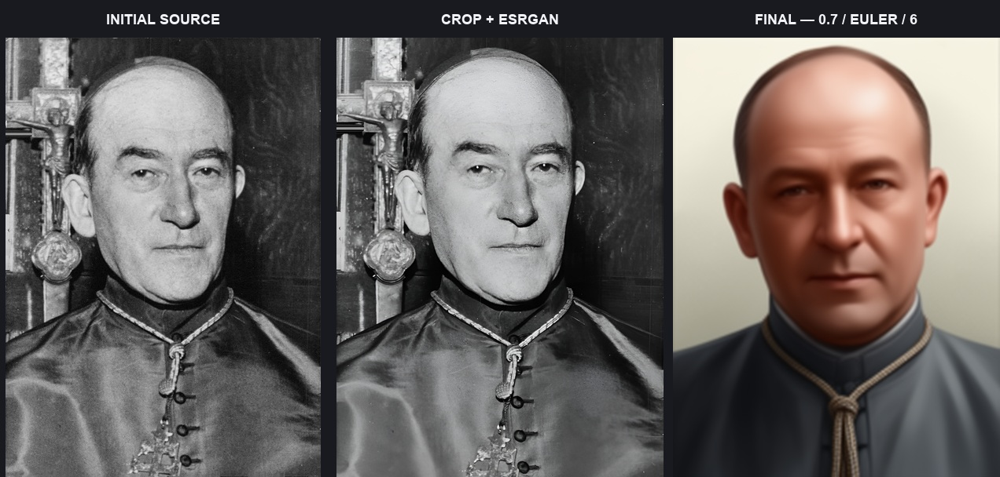
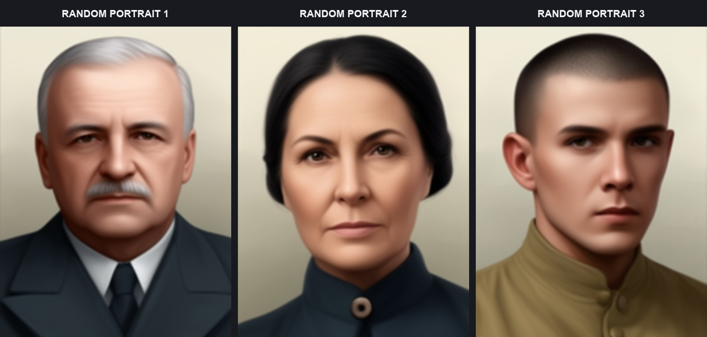
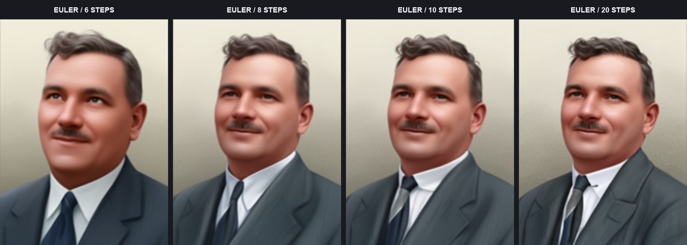
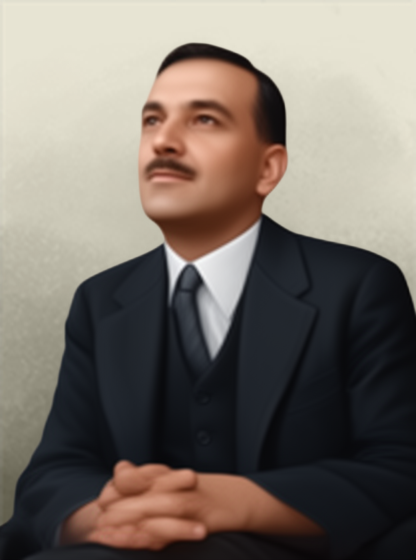

# Local test results

These images were generated locally with the actual FLUX.2 Klein base 9B
stack and `hoi4_portraits_flux2_klein_9b_lora_000002500.safetensors`. All six
sources came from the latest user-supplied `source_originals.zip`, not older
project fixtures. The tested archive contained 43 files and had SHA-256
`71924dbe78019464c21da9aa4d522441cb7faa99fc33b082f42561e2ff086321`.

## Test conditions

- ComfyUI 0.25.0, built-in nodes only;
- Apple-silicon Mac with 16 GB unified memory and MPS low-VRAM offloading;
- 416 × 560 evidence output; the public workflow canvas remains 832 × 1120;
- LoRA strength `0.7`, Euler, six steps, CFG 5;
- full restoration: adjustable crop → RealESRGAN → FLUX restoration → LoRA;
- ESRGAN-only: adjustable crop → RealESRGAN → LoRA;
- the processed image is encoded as the sampler's starting latent to keep the
  original pose and composition anchored.

The reduced size is a local resource compromise, not a mechanical shortcut:
the same committed node/connectivity structure is used, with ordinary input
widgets overridden for each source, seed, prompt, crop, and evidence size.
Attempts at 832 × 1120 and 624 × 840 were stopped because a 16 GB MPS machine
could not complete them in a practical time; they did not expose a node, type,
or connection error.

## Three full-restoration triptychs

Each board shows initial source → cropped RealESRGAN plus FLUX restoration →
final LoRA portrait.



Validated autoprompter description:

```text
hoi4_portrait, middle-aged man with short wavy hair, a moustache, wearing a suit and tie with a visible collar and lapels, looking slightly upward with a subtle smile, head tilted slightly to his right, shoulders squared, shown from the chest up.
```



Validated autoprompter description:

```text
hoi4_portrait, young woman with short dark hair parted to the side, no glasses, wearing a high-collared garment with a visible round fastening, looking directly at the camera with a neutral expression, head slightly tilted, shown from the chest up in an oval crop.
```



Validated autoprompter description:

```text
hoi4_portrait, young man with dark hair parted on the left, clean-shaven, wearing a collared shirt and tie, looking upward and to his right with a slight smile, head tilted, shown from the shoulders up in three-quarter profile with a visible ear, nose, and chin.
```

## Three ESRGAN-only triptychs

Each board shows initial source → cropped RealESRGAN preparation → final LoRA
portrait. No FLUX restoration node is evaluated in this path.


Validated autoprompter description:

```text
hoi4_portrait, middle-aged man with short dark hair, no facial hair, wearing a high-collared uniform with decorative cords and a visible medal, looking slightly to his right with a neutral expression, head tilted slightly and mouth closed, shown from the chest up.
```


Validated autoprompter description:

```text
hoi4_portrait, a man with short dark hair, round-rimmed glasses, no facial hair, and a long narrow face, dressed in a dark suit with a white collared shirt and dark tie, looking directly at the camera with a neutral expression, his head and shoulders angled slightly to his right, shown from the chest up in three-quarter view.
```



Validated autoprompter description:

```text
hoi4_portrait, middle-aged man with a receding hairline, no facial hair, a prominent nose, defined jaw and chin, wearing a high-collared garment with a decorative corded tie and buttoned front, looking directly at the camera with a neutral expression and a slight head tilt, shown from the chest up.
```

## Three no-input portraits

The three portraits use recorded seeds and different person-only prompts. No
source image was supplied, and no prompt requested a game/style, background,
lighting, palette, or rendering treatment.



```text
hoi4_portrait, an older man with a broad forehead, short silver hair, a neat grey moustache, deep-set eyes, and a reserved closed-mouth expression, wearing a dark double-breasted jacket and tie, shown from the chest up facing forward.
```

```text
hoi4_portrait, a middle-aged woman with dark hair pinned into a low bun, arched brows, a firm closed-mouth expression, and a direct gaze, wearing a high-necked dark jacket with a small round brooch, shown from the chest up at a slight angle.
```

```text
hoi4_portrait, a young man with close-cropped dark hair, a narrow face, prominent cheekbones, and a serious direct gaze, wearing a plain buttoned service tunic with no visible insignia, shown from the shoulders up facing slightly right.
```

## Fixed-seed 6/8/10/20-step control

An earlier fixed-seed six-step control also compared Euler, DPM++ 2M, Heun,
and CFG 4. DPM++ 2M did not improve the result, Heun was slower without a
visual gain, and CFG 4 was softer than CFG 5. Euler with CFG 5 was therefore
held constant for the step-count comparison.

Prompt, source, crop, seed, resolution, LoRA strength, CFG, and Euler sampler
are held constant. Only `Flux2Scheduler.steps` changes.



The six-step result best preserves the tight selected crop. Eight steps is the
best refinement compromise: it adds suit structure while keeping the upward
gaze better than 10 or 20. Ten and 20 make the head smaller and the torso more
upright; 20 steps also does not remove the softness imposed by the 416-pixel
evidence canvas. The higher counts are included for direct inspection rather
than assumed to be better simply because they cost more compute.

## Autoprompter validation

The local Qwen vision model produced a first draft for each of the six source
images. A prompt-contract pass then removed unsupported lighting/color claims
and corrected contradictory pose wording. The displayed lines are the exact
validated descriptions sent to the workflows. They describe the person only;
the LoRA supplies the learned look and the workflow controls processing and
background behavior.

## Post-final background test

The previously verified test loads a completed LoRA portrait directly into
the background group. Only BiRefNet, image scaling, mask compositing, and the
final switch are evaluated, proving that background work remains downstream
of final image creation.


