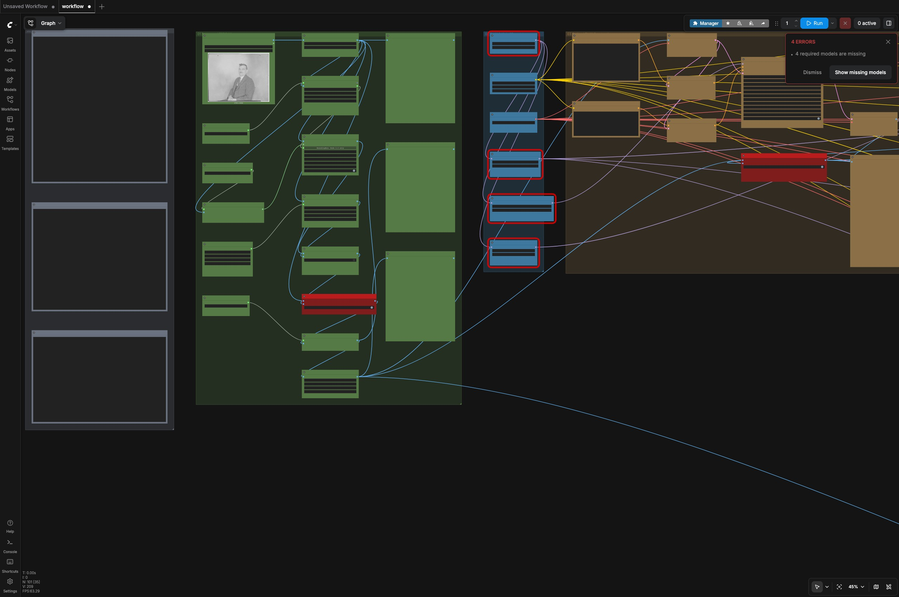
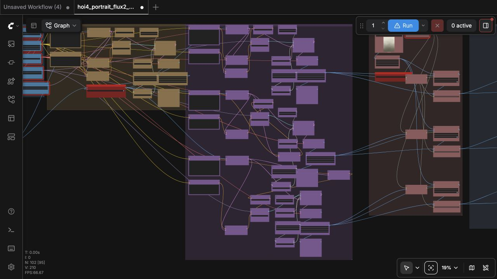

# Testing and audit notes

## Live editor validation

The workflows are loaded in a fresh ComfyUI instance with the `hoi4_portraits`
node pack installed. The captures below are from the running editor: the full
canvas and a readable close-up of the source stage.





The graphs load without missing-node or sampler errors, and the structural
validator finds no invalid links or overlapping cards. The local Mac check does
not contain the multi-GB model set, so ComfyUI stops at resource validation; a
completed image run requires the pinned model download on a RunPod/CUDA
machine.

## Deterministic build

```bash
python scripts/build_workflows.py
```

This recreates the four workflows, their API graphs, and
`workflows/manifest.json`. Generated files are deterministic.

## Structural and layout validation

```bash
python scripts/validate_workflows.py
```

The validator checks:

- JSON shape and unique node/link IDs;
- every link endpoint, source slot, target slot, and type;
- supported workflow classes only (including frontend-only `Note` cards);
- no obsolete comparison-era node types (the validator rejects identity/Krea/PuLID classes);
- required `SaveImage`/`Hoi4SaveDDS` outputs and the three output folders;
- every stage and node visible together on the main canvas;
- no overlapping or too-close cards;
- the distilled FLUX.2 model (never base) and the 2500-step LoRA at strength 1.0;
- the exact prompts (`make this portrait hoi4_portrait style` and the
  documented text-to-image example);
- Euler/simple at CFG 1, guidance 1, 4 steps, denoise 1.0 on every advanced
  sampler card;
- the crop + ESRGAN preview, the comparison row, and the enabled restoration
  toggle;
- no stretched output scaling and exactly four default workflows.

## Unit tests

```bash
python -m unittest discover -s tests -v
```

Tests rebuild into a temporary directory, compare generated artifacts, run the
validator, exercise the installer and `apply_variant.py` against a fake
ComfyUI tree, verify the beginner notes, and check documentation links.

## Comfy Cloud preflight

Comfy Cloud MCP accepts the API files with `dry_run: true` without creating a
job or spending credits. The project LoRA filename is an advisory until the
LoRA is imported into the Cloud model library.

## Local inference evidence

The primary workflow model set is integrity-verified. The public graphs use
LoRA strength `1.00`, CFG 1, guidance 1, Euler, simple, and 4 steps. See
[`test-results.md`](test-results.md) for the generated boards and settings.
