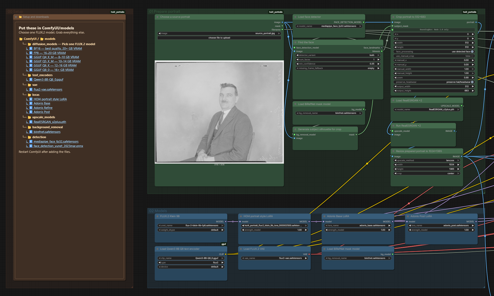
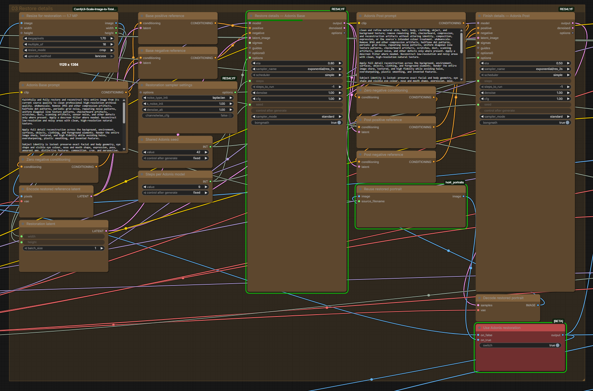
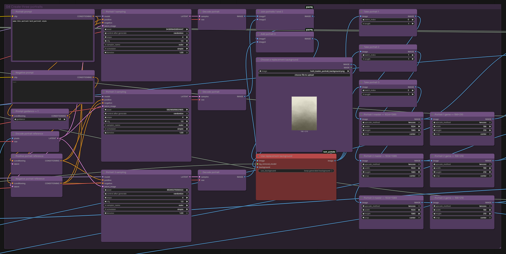
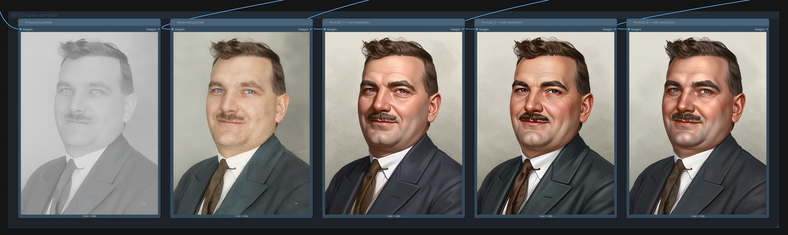
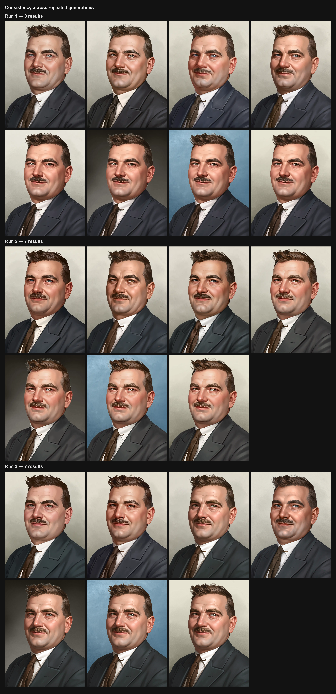
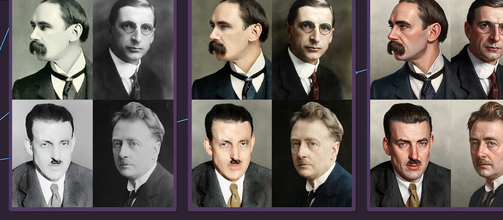
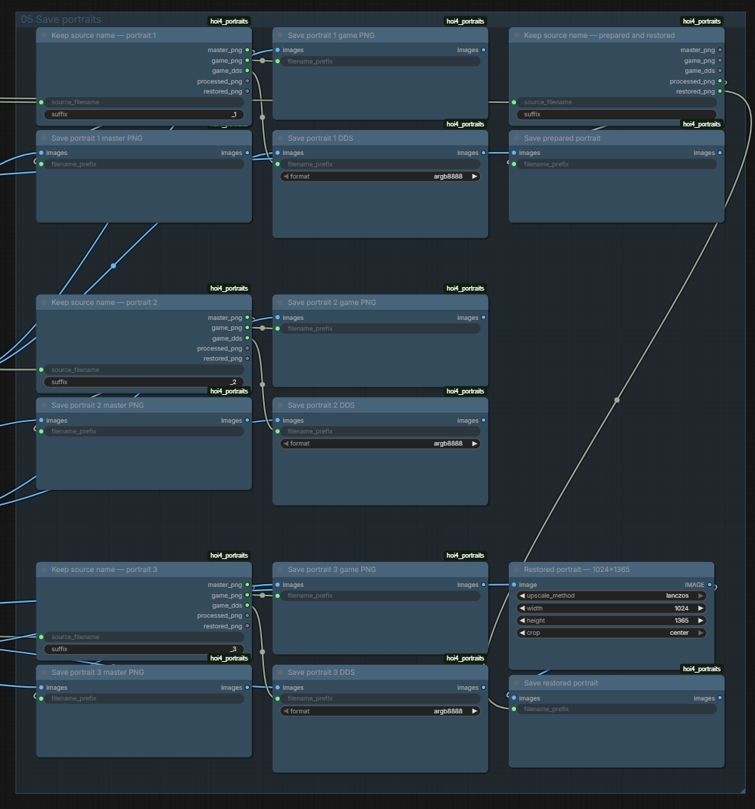

# Workflow guide

## Canvas layout

Every processing step stays on the main canvas. The coloured groups follow the same order as the portrait: preparation, models, restoration, styling, and saving.



The main visible controls are:

| Control | Responsibility |
| --- | --- |
| `📂 Setup and downloads` | Narrow dark-brown card with a clear folder tree and clickable model downloads |
| `KSampler` | Standard ComfyUI sampler with a randomized seed, 4 steps, CFG 1, Euler, simple scheduling, and full denoise |
| `Adaptive Portrait Crop` | Automatic, centered, or manual portrait framing with headwear protection |
| `Use Adonis restoration` | One red true/false control for the complete Base → Post branch; enabled by default |
| `HOI4 Optional Background Replacement` | One optional BiRefNet background-replacement operation; sizing remains separate |
| `HOI4 Batch Input Folder` | List output that executes one source at a time |
| `Keep Input Filename` | Carries each source image stem into every PNG and DDS saver |
| `Batch Output Folders` | Chooses the next numbered batch folder, a custom folder, or direct master saves |
| `Number of portrait candidates` | Creates the selected number of final HOI4 portraits per batch source; defaults to one |
| `Save Portrait PNG` | Automatically writes the master or game-size PNG to the selected output folder |
| `HOI4 Save DDS` | HOI4-ready 156×210 portrait DDS |

The following steps use separate nodes: diffusion model, Qwen Q8 encoder, VAE, every LoRA loader, face detection, subject mask, RealESRGAN, Adonis preprocessing, both prompt encodes, source reference encoding, Adonis Base sampling, Adonis Post reference conditioning, Adonis Post sampling, final VAE decode, restoration switch, master crop, and game crop.

The tuned style settings are CFG `1`, guidance `1`, **Euler**, **simple**, **4 steps**, and denoise `1`. The HOI4 style checkpoint is `hoi4_portrait_flux2_klein_9b_lora_000002500.safetensors` at strength `1`.

## Restoration path

The source, processing-only, and batch canvases inline the Adonis graph from `adonis_post_workflows/Adonis_Base_Post_gguf.json`:

1. scale to `1.7` MP, a multiple of `16`, using crop + Lanczos;
2. combine and encode the general-purpose restoration + Base prompt;
3. zero the Base negative conditioning;
4. VAE-encode the prepared source and apply both Base reference latents;
5. create the correctly sized empty FLUX.2 latent;
6. use the upstream RES4LYF options: Laplacian noise, initial scale `1`, alternate denoise `1`, channelwise CFG off;
7. run a complete six-step Adonis Base generation;
8. combine and encode the general-purpose restoration + Post prompt, zero its negative, and use the Base output latent for both Post reference branches;
9. run a second complete six-step Adonis Post generation from the same empty latent, seed, and options;
10. VAE-decode the Post result;
11. use one red toggle to choose the prepared portrait or the complete Adonis result for every downstream node.

Base and Post share the same fixed seed (`42`) and per-model step (`6`) controls. Base uses eta `0.8`; Post uses eta `0.5`. Both use `exponential/res_2s`, simple scheduling, CFG `1`, full denoise, standard mode, and `steps_to_run = -1`. With the same source and restoration settings, ComfyUI reuses the cached Adonis result. The downstream HOI4 style samplers randomize their seeds independently.

The shared Adonis prompt keeps the original broadly useful restoration detail: `uhdmanscale`, JPEG artifact cleanup, descreening, halftone removal, repeating and diagonal-pattern noise removal, deblurring, focus correction, colour-blotch cleanup, hair-strand separation, unrestricted texture reconstruction outside the face, and full-scene detail recovery. It removes assumptions about cellphones, camera RAW, high ISO, or the subject's gender and always colorizes monochrome and sepia sources with plausible, period-appropriate colours.



## Source workflow

The source canvas has 82 nodes in seven groups:


1. one narrow setup card with model folders and clickable downloads;
2. source loader, face detection, subject mask, focused crop controls, and RealESRGAN—the upload card itself already shows the source;
3. six model/LoRA loaders below the green preparation group;
4. the complete Adonis Base → Post restoration path and its single red toggle;
5. three style samplers, one shared background switch, and separate output sizing;
6. PNG and DDS saves for every portrait, plus prepared and restored 1024×1365 PNGs;
7. a compact portrait-ratio comparison row containing RealESRGAN, Adonis, and the three final full-resolution portraits.

Every source sampler uses the exact prompt:

```text
make this portrait hoi4_portrait style
```

The three HOI4 style samplers randomize their seeds for every generation. The visible loader uses the canonical HOI4 style LoRA at strength `1`. Adonis Base and Post are part of the source path; use the processing-only workflow when you want the restored portrait without style sampling.





## Consistency across generations

The same prompt keeps identity, framing, clothing, and the overall HOI4 treatment consistent while allowing small variations in expression, lighting, and background.



## Text-to-image workflow

This 21-node graph keeps the diffusion model, Qwen encoder, VAE, and style LoRA loaders separate. It runs one standard ComfyUI sampler with a randomized seed, then shows optional background replacement, master sizing, game sizing, all three saves, and one tall full-resolution final preview. Its example prompt is:


```text
hoi4_portrait style, a soviet soldier with the head of a brown bear wearing a soviet hat, ears still visible. No military uniform decorations.
```

## Processing-only workflow

This 45-node graph includes source preparation and the entire Adonis topology. It does not load the style LoRA. RealESRGAN, restored, and the full-resolution final portrait appear together in the comparison row, and the prepared and restored 1024×1365 files are saved separately.


## Batch workflow

This 59-node graph reads compatible images from `/workspace/hoi4-portrait-runpod/input/` on RunPod, the selected input folder on Windows, and `ComfyUI/input/hoi4_portraits_batch/` on manual installations. `HOI4 Batch Input` returns list items, so ComfyUI handles one source at a time in stable, case-insensitive filename order. It rescans the folder on every queue instead of reusing a cached file list. **Number of portrait candidates** defaults to one and repeats the source latent before the standard sampler. One red **Use replacement background** control applies the selected background after generation and before both output sizes; it is disabled by default. Each queue reserves matching `<batch_name>/` folders under `1024x1365/` and `156x210/`. If no name is set, the workflow defaults to the next free `batch_1`, `batch_2`, and so on. Enabling **save without batch folder** keeps outputs directly in their standard resolution folders; the checkbox is disabled by default. Prepared and restored portraits use `processed/` and `restored/` inside the selected full-resolution folder, and DDS files use `dds/` inside the selected game-resolution folder. The three comparison previews remain centered with equal spacing.




## Output contract

On RunPod, all workflows save to:

```text
/workspace/hoi4-portrait-runpod/output/1024x1365/                       master PNG
/workspace/hoi4-portrait-runpod/output/1024x1365/processed/             prepared PNG
/workspace/hoi4-portrait-runpod/output/1024x1365/restored/              restored PNG
/workspace/hoi4-portrait-runpod/output/1024x1365/<batch_name>/               batch master PNGs
/workspace/hoi4-portrait-runpod/output/1024x1365/<batch_name>/processed/     batch prepared PNGs
/workspace/hoi4-portrait-runpod/output/1024x1365/<batch_name>/restored/      batch restored PNGs
/workspace/hoi4-portrait-runpod/output/156x210/                         centered game PNG
/workspace/hoi4-portrait-runpod/output/156x210/dds/                     HOI4-ready DDS
/workspace/hoi4-portrait-runpod/output/156x210/<batch_name>/                 batch game PNGs
/workspace/hoi4-portrait-runpod/output/156x210/<batch_name>/dds/             batch HOI4-ready DDS files
```

Windows uses the output folder selected during installation. Manual and Comfy Cloud installations use `ComfyUI/output/hoi4_portraits/1024x1365/`, `ComfyUI/output/hoi4_portraits/156x210/`, and `ComfyUI/output/hoi4_portraits/156x210/dds/`.

The DDS saver writes uncompressed 32-bit BGRA data with alpha in the A8R8G8B8/B8G8R8A8-style layout used by HOI4 portraits. The PNG and DDS savers follow the portrait output folder selected during installation. Queueing the workflow executes every connected save branch automatically, and numbered counters prevent repeated runs from overwriting existing portraits.



Source, processing-only, and batch workflows derive every output prefix from the current input filename. The source workflow adds `_1`, `_2`, or `_3` to distinguish its candidates. Text-to-image has no input image and therefore uses the stable `text_to_image` prefix.

Master and game sizing use separate `ImageScale` nodes with Lanczos resampling and center cropping. The portrait is never stretched, and there is no redundant upscale after style generation.
